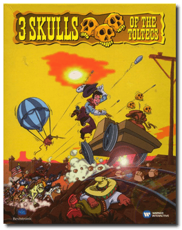
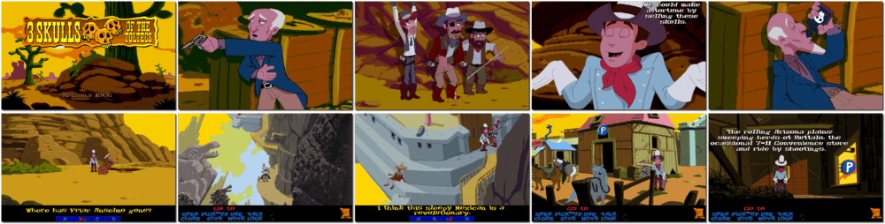

# 3 Skulls of the Toltecs

> ❝ Saddle up and mosey on into town for one of the most challenging, hilarious and exciting adventures this side of Texas! The treasures of the Toltecs are within your reach - riches beyond your wildest dreams. But first, you must locate the three skulls. And believe me - it isn't that easy. You must travel through the wild west and encounter multiple characters, the good, the bad and the downright ugly! ❞
>
> ❝ This game **is not abandonware 🚫** and is still for sale on [GOG 💰](https://www.gog.com/en/game/fenimore_fillmore_3_skulls_of_the_toltecs) and [Steam 💰](https://store.steampowered.com/app/977300/Fenimore_Fillmore_3_Skulls_of_the_Toltecs/). ❞
>

📌 ┃ **Year** ‣ 1996 ┃ **Genre** ‣ Adventure ┃ **Platform** ‣ DOS ┃ **License** ‣ Proprietary ┃ **Category** ‣ 3rd-person • Graphic adventure • Puzzle elements • North America • Western • Comedy ┃ **Media** ‣ CD-ROM 

📦 ┃ **[DOSBox](https://www.dosbox.com/) 🟩** ┃ **[DOSBox Staging](https://dosbox-staging.github.io/) 🟩** ┃ **[DOSBox-X](https://dosbox-x.com/) 🟩** 

📎 ┃ **[Wikipedia](https://en.wikipedia.org/wiki/3_Skulls_of_the_Toltecs)** ┃ **[MobyGames](https://www.mobygames.com/game/3286/3-skulls-of-the-toltecs/)** ┃ **[AbandonwareDOS](https://www.abandonwaredos.com/abandonware-game.php?abandonware=3+Skulls+of+the+Toltecs&gid=2922)** ┃ **[MyAbandonware](https://www.myabandonware.com/game/3-skulls-of-the-toltecs-2sp)** ┃ **[GOG 💰](https://www.gog.com/en/game/fenimore_fillmore_3_skulls_of_the_toltecs)** ┃ **[Steam 💰](https://store.steampowered.com/app/977300/Fenimore_Fillmore_3_Skulls_of_the_Toltecs/)** 

## Installation Notes
- Use the default **drive** and **directory** for the installation location.
- Sound Configuration Options:
  - Select and configure MIDI music driver: **Creative Labs Sound Blaster(TM) 16** (*Attempt to configure sound driver automatically*).
  - Select and configure digital audio driver: **Creative Labs Sound Blaster 16 or AWE32** (*Attempt to configure sound driver automatically*).

