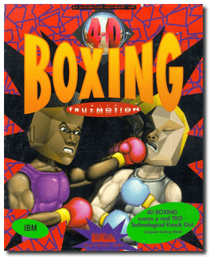
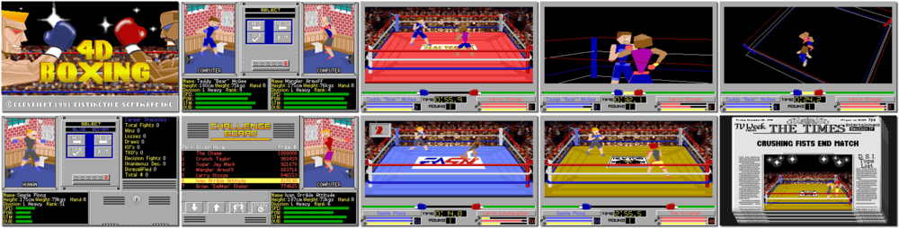

# 4D Boxing

「**4-D Boxing**」「**4D Sports Boxing** (Europe)」

> ❝ Good evening Ladies and Gentlemen. Welcome to the packed car park of Mindscape Palace on this beautiful summer evening for a fabulous night of Championship Boxing. The crowd are going wild as the champion and challenger step into the glare of the TV lights. We can hardly hear the announcer as he introduces the fight to the thousands who have turned up for what promises to be a night of pure sporting genius. Let's go live to our commentary team down at the ringside for a blow-by-blow account of tonight's big fight. ❞
>

📌 ┃ Year: **1992** ┃ Genre: **Sports** ┃ Platform: **DOS** ┃ License: **Abandonware** ┃ Category: **1st-person • Diagonal-down • Boxing** ┃ Media: **Floppy Disk** ┃ **Cracked** 

📦 ┃ **[DOSBox](https://www.dosbox.com/) 🟩** ┃ **[DOSBox Staging](https://dosbox-staging.github.io/) 🟩** ┃ **[DOSBox-X](https://dosbox-x.com/) 🟩** 

📎 ┃ **[Wikipedia](https://en.wikipedia.org/wiki/4D_Sports_Boxing)** ┃ **[MobyGames](https://www.mobygames.com/game/162/4-d-boxing/)** ┃ **[AbandonwareDOS](https://www.abandonwaredos.com/abandonware-game.php?abandonware=4-D+Sports+boxing&gid=1348)** ┃ **[MyAbandonware](https://www.myabandonware.com/game/4-d-boxing-12u)** 

## Additional Notes
- Copy protection bypassed — Enter anything when prompted for the boxer's name.

