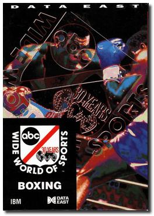
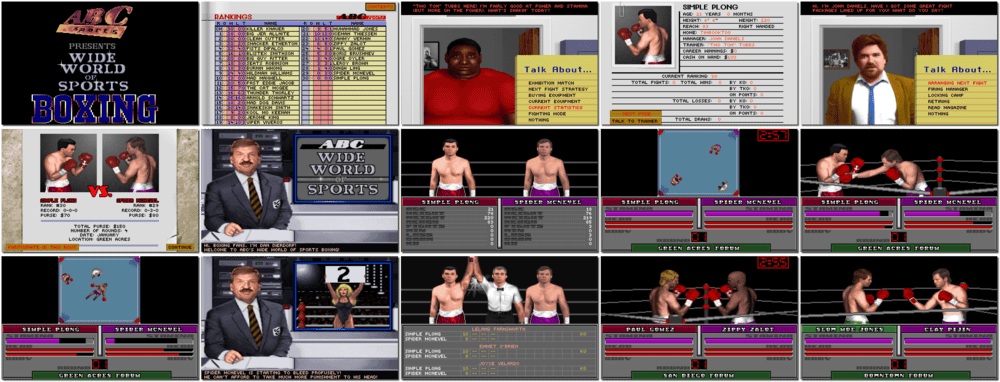

# ABC Wide World of Sports Boxing

「**TV Sports Boxing** (European)」

> ❝ Spanning the globe for 30 years, ABC's Wide World of Sports has brought billions of sports fans up close and personal for boxing duels. But boxing is much more than just throwing punches. It's a sport that tests the core of your being. Spirit, heart, desire, strength and stamina are all stretched beyond their breaking points and then asked to go just one more round. ABC's Wide World of Sports Boxing is far more than the typical punching games. Our detailed attention to creating a premier simulation and role-playing environment delivers a knock-out gaming combination that challenges the rest. ❞
>

📌 ┃ **Year** ‣ 1991 ┃ **Genre** ‣ Action • Sports • Strategy ┃ **Platform** ‣ DOS ┃ **License** ‣ Freeware ┃ **Category** ‣ Side view • Boxing ┃ **Media** ‣ Floppy Disk ┃ **Copy Protection** 

📦 ┃ **[DOSBox](https://www.dosbox.com/)** ‣ 0.74-3 🟨 (no sound effects) ┃ **[DOSBox Staging](https://dosbox-staging.github.io/)** ‣ 0.80.1 🟨 (no sound effects) ┃ **[DOSBox-X](https://dosbox-x.com/) 🟩** 

📎 ┃ **[Wikipedia](https://en.wikipedia.org/wiki/ABC_Wide_World_of_Sports_Boxing)** ┃ **[MobyGames](https://www.mobygames.com/game/15780/abc-wide-world-of-sports-boxing/)** ┃ **[AbandonwareDOS](https://www.abandonwaredos.com/abandonware-game.php?abandonware=TV+Sports%3A+Boxing&gid=1153)** ┃ **[MyAbandonware](https://www.myabandonware.com/game/abc-wide-world-of-sports-boxing-12z)** 

## Installation Notes
- Hard Disk Installation: **(Do not install)**.
- Sound System: **Roland Sound Card**.
- Graphics Adapter: **VGA**.
- Calibrate keys for **Player One** (and **Player Two** if desired).

## Additional Notes
- Consult `Assets/manual.pdf` for the game copy protection.

