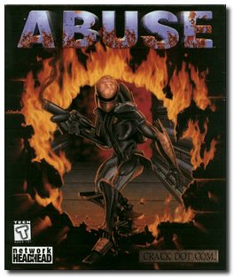
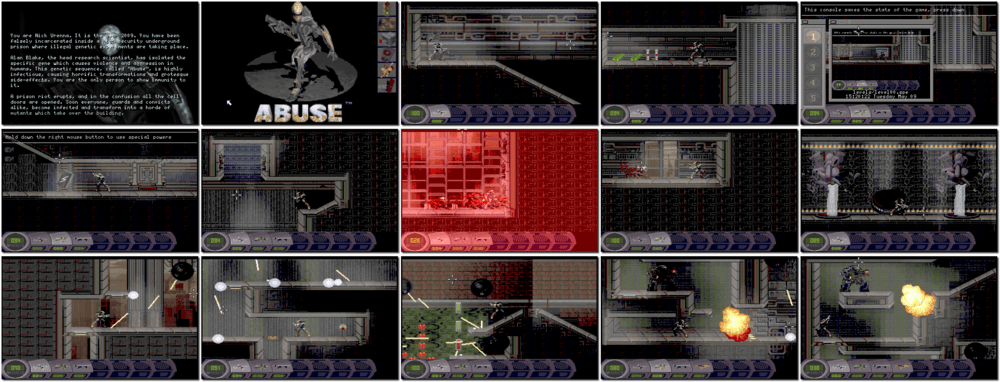

# Abuse

「**Them**」

> ❝ All Hell has broken loose! Military experiments have created bloodthirsty genetic mutations. You are the only hope to prevent them from reaching the outside world - if you can slaughter the grotesque monsters, solve the deadly puzzles and survive the constant assaults. ❞
>
> ❝ Approximately two years after the release of the game, Crack dot Com decided to release the game's source code. ❞ — *Wikipedia*
>

📌 ┃ **Year** ‣ 1995 ┃ **Genre** ‣ Action ┃ **Platform** ‣ DOS ┃ **License** ‣ Freeware ┃ **Media** ‣ CD-ROM 

📦 ┃ **[DOSBox](https://www.dosbox.com/) 🟩** ┃ **[DOSBox Staging](https://dosbox-staging.github.io/) 🟩** ┃ **[DOSBox-X](https://dosbox-x.com/) 🟩** 

📎 ┃ **[Wikipedia](https://en.wikipedia.org/wiki/Abuse_(video_game))** ┃ **[MobyGames](https://www.mobygames.com/game/389/abuse/)** ┃ **[MyAbandonware](https://www.myabandonware.com/game/abuse-1ne)** ┃ **[ModDB](https://www.moddb.com/games/abuse)** 

## Installation Notes
- Use the default **drive** and **directory** for the installation location.
- Audio configuration:
  - Select Digital: **Sound Blaster 16**; Port: **220**; DMA: **1**; IRQ: **7**.
  - Select MIDI: **MPU-401**; Port: **330**.

---

