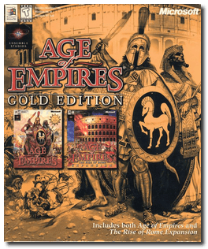
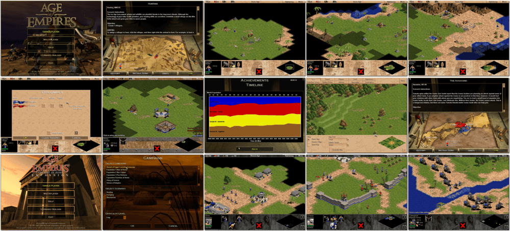

# Age of Empires: Gold Edition

「**Age of Empires** (Base)」「**Age of Empires: The Rise of Rome** (Add-on)」

> ❝ How will you rule the world? Conquer enemy civilisations? Discover the world's secrets? Accumulate wealth? As the guiding spirit of a Stone Age tribe, follow one of these paths to build the greatest nation on earth. Age of Empires: choose your favourite form of world domination. ❞
>
> ❝ This game **is not abandonware 🚫**. The **Definitive Edition** release is available on [Steam 💰](https://store.steampowered.com/app/1017900/Age_of_Empires_Definitive_Edition/). ❞
>

📌 ┃ **Year** ‣ 1997 ┃ **Genre** ‣ Strategy ┃ **Platform** ‣ Windows 9x ┃ **License** ‣ Proprietary ┃ **Media** ‣ CD-ROM ┃ **Patched** ‣ Age of Empires 1.0c ┃ **Patched** ‣ Age of Empires: The Rise of Rome 1.0a ┃ **Compilation** 

📦 ┃ **[DOSBox](https://www.dosbox.com/) ⬜ • Untested** ┃ **[DOSBox Staging](https://dosbox-staging.github.io/) ⬜ • Untested** ┃ **[DOSBox-X](https://dosbox-x.com/) 🟩** 

📎 ┃ **Age of Empires** ‣ [Wikipedia](https://en.wikipedia.org/wiki/Age_of_Empires_(video_game)) • [MobyGames](https://www.mobygames.com/game/384/age-of-empires/) • [MyAbandonware](https://www.myabandonware.com/game/age-of-empires-3fw) • [Fandom](https://ageofempires.fandom.com/wiki/Age_of_Empires) ┃ **Age of Empires: The Rise of Rome** ‣ [Wikipedia](https://en.wikipedia.org/wiki/Age_of_Empires_(video_game)#The_Rise_of_Rome) • [MobyGames](https://www.mobygames.com/game/1249/age-of-empires-the-rise-of-rome/) • [MyAbandonware](https://www.myabandonware.com/game/age-of-empires-the-rise-of-rome-a48) • [Fandom](https://ageofempires.fandom.com/wiki/Age_of_Empires:_The_Rise_of_Rome) ┃ **Age of Empires: Gold Edition** ‣ [MobyGames](https://www.mobygames.com/game/1512/age-of-empires-gold-edition/) ┃ **[Series](https://en.wikipedia.org/wiki/Age_of_Empires)** ┃ **Definitive Edition** ‣ [Steam 💰](https://store.steampowered.com/app/1017900/Age_of_Empires_Definitive_Edition/) 

## Host Requirements
- Download a patch file manually from [Soggi.org](https://soggi.org/misc/game-patches.htm) labeled *"Age of Empires / The Rise of Rome (Ensemble Studios / Microsoft) - patch 1.0c / 1.0a (DE/EN/FR)"*, rename it to `patch.7z`, and place it in the `Assets` directory.

## Installation Notes
- Open *My Computer* and double-click on the `D:` CD-ROM drive to start the installation.
- Use the default **drive** and **directory** for the installation location.
- Select the largest installation size when prompted.
- Applying patch:
  - A patch is available on `C:\PATCH\PATCH.7Z`. Extract the compressed file and run `AOEPATCH.EXE`.

---

