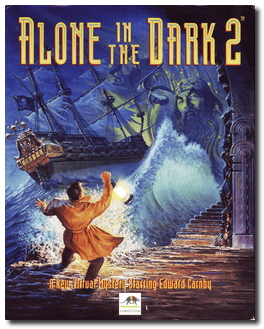

# Alone in the Dark 2

「**Alone in the Dark: Jack is Back**」「**Alone in the Dark: One-Eyed Jack's Revenge**」

> ❝ You are the elusive detective of the macabre, Edward Carnby. A kidnapped child depends on your super sleuthing skills and astonishing ability to outwit bands of ruthless gangsters, smugglers and pirates. One-Eyed Jack, their ruthless leader, would give his remaining eye to see you permanently retired. Are you ready for the challenge of your life? Steel nerves and quicksilver thinking are your trademarks. Without hesitation, you set out to rescue young Grace Saunders, the missing girl. Your razor-sharp instincts lead you to the place no one in their right mind would go. One Eyed Jack's infamous hideout, Hell's Kitchen is a forbidding mansion that resonates with venomous evil. ❞
>
> ❝ This game **is not abandonware 🚫** and **The Trilogy 1+2+3** release is available on [GOG 💰](https://www.gog.com/en/game/alone_in_the_dark_the_trilogy_123). ❞
>

📌 ┃ **Year** ‣ 1993 ┃ **Genre** ‣ Action ┃ **Platform** ‣ DOS ┃ **License** ‣ Proprietary ┃ **Category** ‣ 3rd-person • Puzzle elements • Survival horror • Interwar • Detective • Horror ┃ **Media** ‣ CD-ROM 

📦 ┃ **[DOSBox](https://www.dosbox.com/) 🟩** ┃ **[DOSBox Staging](https://dosbox-staging.github.io/) 🟩** ┃ **[DOSBox-X](https://dosbox-x.com/) 🟩** 

📎 ┃ **[Wikipedia](https://en.wikipedia.org/wiki/Alone_in_the_Dark_2_(video_game))** ┃ **[MobyGames](https://www.mobygames.com/game/907/alone-in-the-dark-2/)** ┃ **[AbandonwareDOS](https://www.abandonwaredos.com/abandonware-game.php?abandonware=Alone+in+the+Dark+2&gid=1917)** ┃ **[MyAbandonware](https://www.myabandonware.com/game/alone-in-the-dark-2-2nw)** ┃ **[Fandom](https://aloneinthedark.fandom.com/wiki/Alone_in_the_Dark_2)** ┃ **[Series](https://en.wikipedia.org/wiki/Alone_in_the_Dark)** ┃ **Alone in the Dark: The Trilogy 1+2+3** ‣ [GOG 💰](https://www.gog.com/en/game/alone_in_the_dark_the_trilogy_123) 

## Installation Notes
- Select **Install**.
- Use the default **drive** and **directory** for the installation location.

