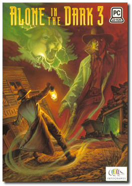

# Alone in the Dark 3

「**Alone in the Dark 3: Ghosts in Town**」

> ❝ Super-sleuth Edward Carnby is back in the saddle in the gritty virtual adventure! This time, the detective travels to the Wild West ghost town of Slaughter Gulch to piece together a dusty puzzle: the mysterious disappearance of Hollywood heroine Emily Hartwood and her film crew. But before Carnby can break the curse that grips the town, he must out-wit and out-draw the trigger-happy sharpshooters, deranged prospectors, and bloodthirsty lost souls who lurk there. ❞
>
> ❝ This game **is not abandonware 🚫** and **The Trilogy 1+2+3** release is available on [GOG 💰](https://www.gog.com/en/game/alone_in_the_dark_the_trilogy_123). ❞
>

📌 ┃ Year: **1994** ┃ Genre: **Action** ┃ Platform: **DOS** ┃ License: **Proprietary** ┃ Category: **3rd-person • Puzzle elements • Survival horror • Interwar • Horror** ┃ Media: **CD-ROM** 

📦 ┃ **[DOSBox](https://www.dosbox.com/) 🟩** ┃ **[DOSBox Staging](https://dosbox-staging.github.io/) 🟩** ┃ **[DOSBox-X](https://dosbox-x.com/) 🟩** 

📎 ┃ **[Wikipedia](https://en.wikipedia.org/wiki/Alone_in_the_Dark_3)** ┃ **[Wikipedia - Alone in the Dark Series](https://en.wikipedia.org/wiki/Alone_in_the_Dark)** ┃ **[MobyGames](https://www.mobygames.com/game/908/alone-in-the-dark-3/)** ┃ **[AbandonwareDOS](https://www.abandonwaredos.com/abandonware-game.php?abandonware=Alone+in+the+Dark+3&gid=2325)** ┃ **[MyAbandonware](https://www.myabandonware.com/game/alone-in-the-dark-3-2y6)** ┃ **[Alone in the Dark Fandom](https://aloneinthedark.fandom.com/wiki/Alone_in_the_Dark_3)** ┃ Alone in the Dark: The Trilogy 1+2+3: **[GOG 💰](https://www.gog.com/en/game/alone_in_the_dark_the_trilogy_123)** 

## Installation Notes
- Select **Install**.
- Use the default **drive** and **directory** for the installation location.

