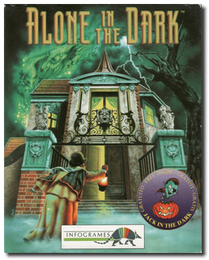
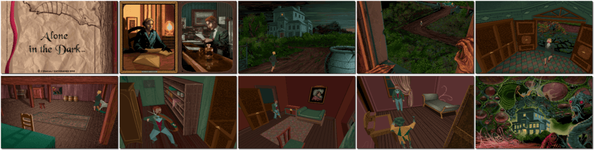

# Alone in the Dark

「**AITD**」「**Call of Cthulhu: Doom of Derceto**」「**Screams in the Dark**」「**Jack in the Dark**」

> ❝ A suspicious suicide. A chilling curse. A malevolent power. And a wicked dark secret. You are in Derceto, a legendary Louisiana mansion — where, against your better judgement, you're drawn into a world of shadows to explore the darker side of Jeremy Hartwood's imagination. Despite a paralyzing sense of personal danger, your quest for truth drives you to investigate the old house. By entering Derceto, you are entering the daily nightmare of Jeremy Hartwood's life. You will be facing the torturous howls that resound deep within its halls. You didn't foresee the shadowy corridors that seemingly have no end. You couldn't anticipate the brooding, gloom-filled rooms, the pervasive weight of dread, and the heavy sense of evil filling the atmosphere and the house itself. ❞
>
> ❝ This game **is not abandonware 🚫** and **The Trilogy 1+2+3** release is available on [GOG 💰](https://www.gog.com/en/game/alone_in_the_dark_the_trilogy_123). ❞
>

📌 ┃ Year: **1992** ┃ Genre: **Action** ┃ Platform: **DOS** ┃ License: **Proprietary** ┃ Category: **3rd-person • Puzzle elements • Survival horror • Interwar • Horror** ┃ Media: **CD-ROM** ┃ Compilation: **Jack in the Dark** 

📦 ┃ **[DOSBox](https://www.dosbox.com/) 🟩** ┃ **[DOSBox Staging](https://dosbox-staging.github.io/) 🟩** ┃ **[DOSBox-X](https://dosbox-x.com/) 🟩** 

📎 ┃ **[Wikipedia](https://en.wikipedia.org/wiki/Alone_in_the_Dark_(1992_video_game))** ┃ **[Wikipedia - Alone in the Dark Series](https://en.wikipedia.org/wiki/Alone_in_the_Dark)** ┃ **[MobyGames](https://www.mobygames.com/game/325/alone-in-the-dark/)** ┃ **[MobyGames - Jack in the Dark](https://www.mobygames.com/game/1231/jack-in-the-dark/)** ┃ **[AbandonwareDOS](https://www.abandonwaredos.com/abandonware-game.php?abandonware=Alone+in+the+Dark&gid=1737)** ┃ **[AbandonwareDOS - Jack in the Dark](https://www.abandonwaredos.com/abandonware-game.php?abandonware=Jack+in+the+Dark&gid=2731)** ┃ **[MyAbandonware](https://www.myabandonware.com/game/alone-in-the-dark-1rg)** ┃ **[MyAbandonware - Jack in the Dark](https://www.myabandonware.com/game/jack-in-the-dark-2ab)** ┃ **[Alone in the Dark Fandom](https://aloneinthedark.fandom.com/wiki/Alone_in_the_Dark_(1992))** ┃ Alone in the Dark: The Trilogy 1+2+3: **[GOG 💰](https://www.gog.com/en/game/alone_in_the_dark_the_trilogy_123)** 

## Installation Notes
- Select *language* and then **Install**.
- Use the default **drive** and **directory** for the installation location.

