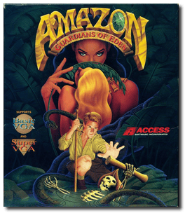
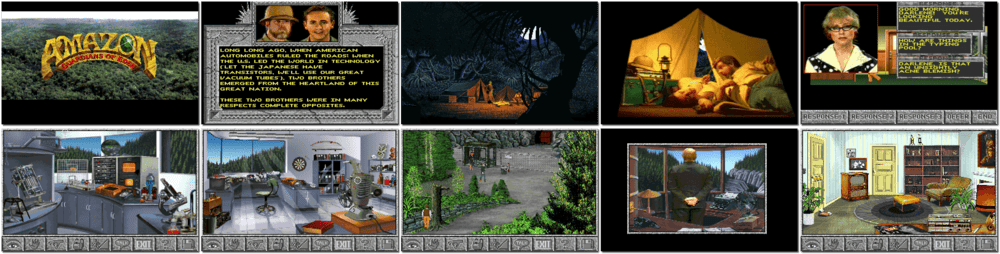

# Amazon: Guardians of Eden

> ❝ Journey back to 1957 on an expedition to the dark heart of the Amazon Basin. A desperate, crazed message sends you on a perilous search through a land where legends come to life, danger hides behind every corner, and incredible treasures await. The plot follows the adventure of Jason Roberts. Roberts starts his expedition to help find his brother and eventually races for a lost treasure. ❞
>
> ❝ This game **is not abandonware 🚫** and is still for sale on [GOG 💰](https://www.gog.com/en/game/amazon_guardians_of_eden). ❞
>

📌 ┃ **Year** ‣ 1992 ┃ **Genre** ‣ Adventure ┃ **Platform** ‣ DOS ┃ **License** ‣ Proprietary ┃ **Media** ‣ CD-ROM 

📦 ┃ **[DOSBox](https://www.dosbox.com/) 🟩** ┃ **[DOSBox Staging](https://dosbox-staging.github.io/) 🟩** ┃ **[DOSBox-X](https://dosbox-x.com/) 🟩** 

📎 ┃ **[Wikipedia](https://en.wikipedia.org/wiki/Amazon:_Guardians_of_Eden)** ┃ **[MobyGames](https://www.mobygames.com/game/3287/amazon-guardians-of-eden/)** ┃ **[MyAbandonware](https://www.myabandonware.com/game/amazon-guardians-of-eden-1bz)** ┃ **[GOG 💰](https://www.gog.com/en/game/amazon_guardians_of_eden)** 

## Installation Notes
- Use the default **drive** and **directory** for the installation location.
- Enter the letter that corresponds to your CDROM drive: Press `D`.
- Select the level(s) of hints you want available during the game: Pick your choice (Press `0`, `1`, `2`, or `3`).
- Select device to play MIDI music: Press `6`.
- Select Sound Blaster port address: Press `2`.
- Select Sound Blaster interrupt number: Press `7`.
- Select Sound Blaster Pro DMA channel: Press `1`.
- Select the device which will play digital sound effects and voices: Press `4`.

---

