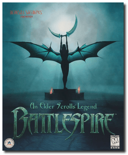
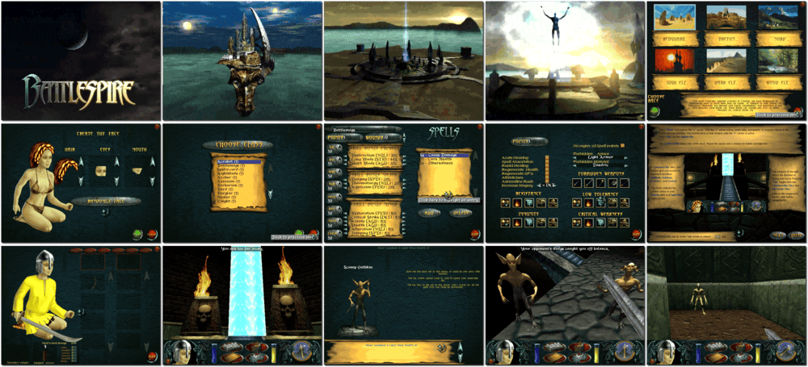

# An Elder Scrolls Legend: Battlespire

「**Battlespire**」

> ❝ The Imperial Battle College has lost contact with the Battlespire, an elite training centre hidden in a pocket realm of Oblivion. An agent sent to investigate discovers the Battlespire's staff dead. The gate back to Tamriel is blocked and the facility is under siege by vile Daedra. The only way out is to go deep into darkness of the Daedric Realms. ❞
>
> ❝ This game **is not abandonware 🚫** and is still for sale on [GOG 💰](https://www.gog.com/en/game/an_elder_scrolls_legend_battlespire). ❞
>

📌 ┃ **Year** ‣ 1997 ┃ **Genre** ‣ Role-playing ┃ **Platform** ‣ DOS ┃ **License** ‣ Proprietary ┃ **Category** ‣ 1st-person • Action RPG • Fantasy ┃ **Media** ‣ CD-ROM ┃ **Patched** 

📦 ┃ **[DOSBox](https://www.dosbox.com/) 🟩** ┃ **[DOSBox Staging](https://dosbox-staging.github.io/) 🟩** ┃ **[DOSBox-X](https://dosbox-x.com/) 🟩** 

📎 ┃ **[Wikipedia](https://en.wikipedia.org/wiki/An_Elder_Scrolls_Legend:_Battlespire)** ┃ **[MobyGames](https://www.mobygames.com/game/1579/an-elder-scrolls-legend-battlespire/)** ┃ **[AbandonwareDOS](https://www.abandonwaredos.com/abandonware-game.php?abandonware=An+Elder+Scrolls+Legend%3A+Battlespire&gid=2734)** ┃ **[MyAbandonware](https://www.myabandonware.com/game/an-elder-scrolls-legend-battlespire-bkn)** ┃ **[Fandom](https://elderscrolls.fandom.com/wiki/An_Elder_Scrolls_Legend:_Battlespire)** ┃ **[Series](https://en.wikipedia.org/wiki/The_Elder_Scrolls)** ┃ **[GOG 💰](https://www.gog.com/en/game/an_elder_scrolls_legend_battlespire)** 

## Installation Notes
- Select **Install Battlespire**.
- Use the default **drive** and **directory** for the installation location.
- Bypass the internal video driver? Select **Normal**.
- Select and configure digital audio driver: **Creative Labs Sound Blaster 16 or AWE32** (*Attempt to configure sound driver automatically*).
- Enable captions? Select **Yes**.
- Would you like to disable or enable childguard? Select either one that suits your need.
  - Enter password if you enable childguard.

## Additional Notes
- Disregard any warning about RAM+Swap. Press any key to start the game.

