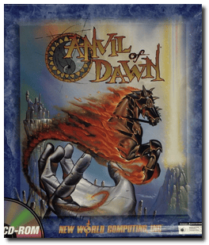

# Anvil of Dawn

> ❝ You embark on a noble journey across Tempest in the ultimate fantasy adventure. Your mission is to rescue humanity from an evil fate with battle, skill, magic, and wits. Explore a massive terrain in 3D while solving puzzles, overcoming traps, and enjoying the beauty and scope of the outdoor scenes. Quest through dungeons where 3D walls add realism, and creatures all but lunge out at you in the attack. You have more than 25 spells and magical objects at your disposal, each drawing upon one of the elemental forces such as fire, water, wind, and lightning. ❞
>
> ❝ This game **is not abandonware 🚫** and is still for sale on [GOG 💰](https://www.gog.com/en/game/anvil_of_dawn). ❞
>

📌 ┃ **Year** ‣ 1995 ┃ **Genre** ‣ Role-playing ┃ **Platform** ‣ DOS ┃ **License** ‣ Proprietary ┃ **Category** ‣ 1st-person • Action RPG • Fantasy ┃ **Media** ‣ CD-ROM ┃ **Patched** 

📦 ┃ **[DOSBox](https://www.dosbox.com/) 🟩** ┃ **[DOSBox Staging](https://dosbox-staging.github.io/) 🟩** ┃ **[DOSBox-X](https://dosbox-x.com/) 🟩** 

📎 ┃ **[Wikipedia](https://en.wikipedia.org/wiki/Anvil_of_Dawn)** ┃ **[MobyGames](https://www.mobygames.com/game/2142/anvil-of-dawn/)** ┃ **[AbandonwareDOS](https://www.abandonwaredos.com/abandonware-game.php?abandonware=Anvil+of+dawn&gid=1441)** ┃ **[MyAbandonware](https://www.myabandonware.com/game/anvil-of-dawn-2qt)** ┃ **[GOG 💰](https://www.gog.com/en/game/anvil_of_dawn)** 

## Installation Notes
- Press `3` to select **3. Install Anvil of Dawn (Maximum Installation)**.
- Use the default **drive** and **directory** for the installation location.
- Audio configuration:
  - Select Digital: **Sound Blaster 16**; Port: **220**; DMA: **1**; IRQ: **7**.
  - Select MIDI: **Sound Blaster 16**; Port: **388**.

