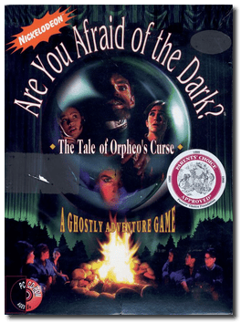
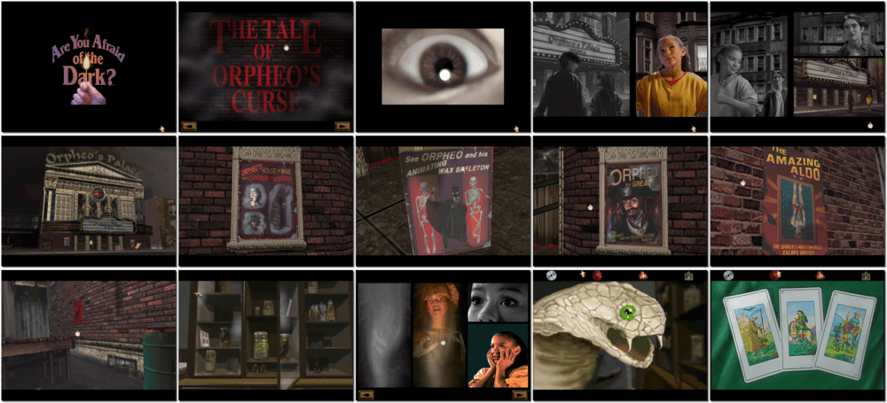

# Are You Afraid of the Dark? The Tale of Orpheo's Curse

「**Are You Afraid of the Dark? The Tale of Orpheo's Curse: A Ghostly Adventure Game**」

> ❝ You are a brother and sister team trapped inside a haunted theatre. You discover Orpheo, the Mad Magician, has put an evil curse on it, or so you think. Dare to explore this ghoulish theatre as you search for clues to unlock the mystery. Remember, surprises await you at every turn. Watch out! You'll encounter strange and twisted characters. Listen closely to the talking ghosts. Search for clues as you solve dozens of puzzles. ❞
>

📌 ┃ **Year** ‣ 1994 ┃ **Genre** ‣ Adventure ┃ **Platform** ‣ DOS ┃ **License** ‣ Abandonware ┃ **Category** ‣ 1st-person • Detective • Horror ┃ **Media** ‣ CD-ROM 

📦 ┃ **[DOSBox](https://www.dosbox.com/) 🟩** ┃ **[DOSBox Staging](https://dosbox-staging.github.io/) 🟩** ┃ **[DOSBox-X](https://dosbox-x.com/) 🟩** 

📎 ┃ **[Wikipedia](https://en.wikipedia.org/wiki/Are_You_Afraid_of_the_Dark%3F_The_Tale_of_Orpheo%27s_Curse)** ┃ **[MobyGames](https://www.mobygames.com/game/9583/are-you-afraid-of-the-dark-the-tale-of-orpheos-curse/)** ┃ **[MyAbandonware](https://www.myabandonware.com/game/are-you-afraid-of-the-dark-the-tale-of-orpheo-s-curse-332)** 

## Installation Notes
- Use the default **drive** and **directory** for the installation location.

