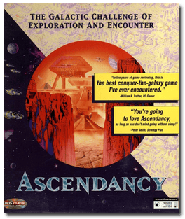
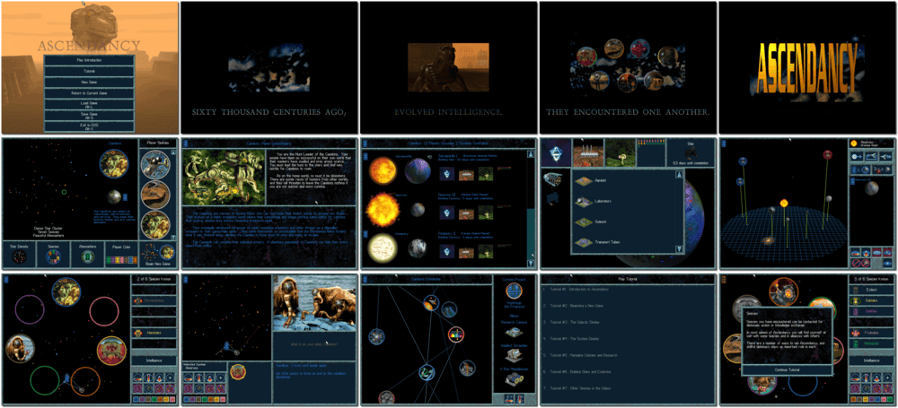

# Ascendancy

> ❝ The age of discovery is upon you. Explore the unknown using a delicate balance of courage and caution. The survival of an entire species is at stake. Will your people fade into obscurity or gain Ascendancy over a galaxy? Who is hiding in the undiscovered darkness? What lies beyond the planet of your birth? Welcome to a universe of unlimited possibilities. ❞
>

📌 ┃ **Year** ‣ 1995 ┃ **Genre** ‣ Strategy ┃ **Platform** ‣ DOS ┃ **License** ‣ Abandonware ┃ **Media** ‣ CD-ROM ┃ **Patched** ‣ 1.6.5 ┃ **Patched** ‣ 1.6.10 (Antagonizer) 

📦 ┃ **[DOSBox](https://www.dosbox.com/) 🟩** ┃ **[DOSBox Staging](https://dosbox-staging.github.io/) 🟩** ┃ **[DOSBox-X](https://dosbox-x.com/) 🟩** 

📎 ┃ **[Wikipedia](https://en.wikipedia.org/wiki/Ascendancy_(video_game))** ┃ **[MobyGames](https://www.mobygames.com/game/257/ascendancy/)** ┃ **[MyAbandonware](https://www.myabandonware.com/game/ascendancy-2qs)** ┃ **[Unofficial Online Handbook](https://www.b-sting.nl/ascendancy/index.html)** 

## Installation Notes
- Use the default **drive** and **directory** for the installation location.
- Sound Configuration Utility:
  - Select and configure digital audio driver: **Creative Labs Sound Blaster 16 or AWE32** (*Attempt to configure sound driver automatically*).

## Additional Notes
- Version 1.6.5 add-on is the official Ascendancy patch.
- Version 1.6.10 add-on is the official Ascendancy Antagonizer AI module released by The Logic Factory (more challenging computer opponents).
- You can toggle **Cheat** and **Autoplay** features before running the game.

---

