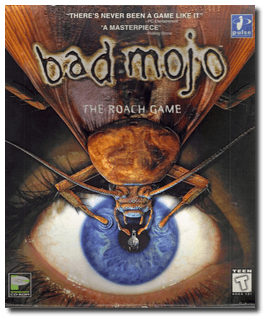
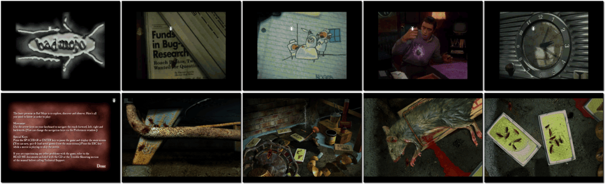

# Bad Mojo

「**Bad Mojo: The Roach Game**」「**Booger Project**」

> ❝ Inside a seedy, dilapidated bar in San Fransisco, your dreams of escape are about to be realized. But remembering one last keepsake, magic suddenly seized you, and your transformation begins. You emerge as a cockroach from within the damp walls of Eddie's bar. Enter a world of perilous puzzles and bizarre perspectives. What you discover may shock you. What you don't may kill you. Either way, you won't come out the same person. You may not even come out as a person at all. ❞
>
> ❝ This version is the original/legacy release for DOS. This game **is not abandonware 🚫**. A **Redux** release is available on [Steam 💰](https://store.steampowered.com/app/255960/Bad_Mojo_Redux/). ❞
>

📌 ┃ **Year** ‣ 1996 ┃ **Genre** ‣ Adventure ┃ **Platform** ‣ Windows 3.1x ┃ **License** ‣ Proprietary ┃ **Category** ‣ Top-down • Real-time • Graphic adventure • North America • Thriller ┃ **Media** ‣ CD-ROM 

📦 ┃ **[DOSBox](https://www.dosbox.com/) 🟩** ┃ **[DOSBox Staging](https://dosbox-staging.github.io/) 🟩** ┃ **[DOSBox-X](https://dosbox-x.com/) 🟩** 

📎 ┃ **[Wikipedia](https://en.wikipedia.org/wiki/Bad_Mojo)** ┃ **[MobyGames](https://www.mobygames.com/game/2238/bad-mojo/)** ┃ **[MyAbandonware](https://www.myabandonware.com/game/bad-mojo-3gm)** ┃ **Redux** ‣ [Steam 💰](https://store.steampowered.com/app/255960/Bad_Mojo_Redux/) 

## Installation Notes
- Use the default **drive** and **directory** for the installation location.
- Do not install *QuickTime*. Click **Exit** when prompted. Your Windows 3.1x has the most recent version.
- Exit Windows and DOSBox once the installation is complete (**Program Manager > File > Exit Windows**) and rerun the `Launch` script to start the program.

