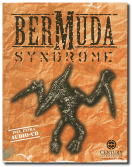
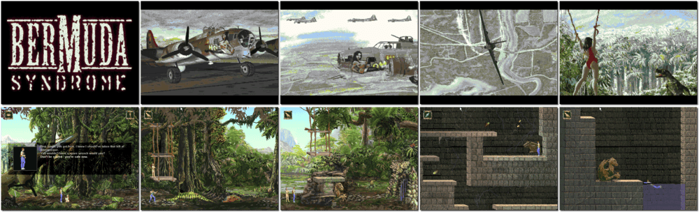

# Bermuda Syndrome

> ❝ You are Jack J. Thompson. Destiny has brought you here. It's 1942. Shot down in the region of the infamous Bermuda Triangle, our hero has crash-landed into a dense tropical jungle and a whole heap of trouble. Are you a god? It is more than divine intervention to fend off attacks from restless natives and ferocious dinosaurs, save a distressed damsel from a fate worse than death, and escape this insanity to return home. There's no time to party. Sharp reflexes and lateral thinking are essential if Jack is to escape from this land that time doesn't even know about. It is not a holiday resort. ❞
>

📌 ┃ Year: **1996** ┃ Genre: **Action** ┃ Platform: **Windows 3.1x** ┃ License: **Abandonware** ┃ Category: **Side view • Platform • Puzzle elements** ┃ Media: **CD-ROM** 

📦 ┃ **[DOSBox](https://www.dosbox.com/) 🟩** ┃ **[DOSBox Staging](https://dosbox-staging.github.io/) 🟩** ┃ **[DOSBox-X](https://dosbox-x.com/) 🟩** 

📎 ┃ **[Wikipedia](https://en.wikipedia.org/wiki/Bermuda_Syndrome)** ┃ **[MobyGames](https://www.mobygames.com/game/624/bermuda-syndrome/)** ┃ **[MyAbandonware](https://www.myabandonware.com/game/bermuda-syndrome-a3u)** 

## Installation Notes
- Click **Continue** to begin the installation process.
- Select **Copy to HD** option.
- Select **Yes, I have a giant harddisk!** option.
- Use the default **drive** and **directory** for the installation location.
- Leave the Setup screen as is and **Save Settings**.
- Exit Windows and DOSBox once the installation is complete (**Program Manager > File > Exit Windows**) and rerun the `Launch` script to start the program.

## Additional Notes
- **IMPORTANT:** The downloaded CD-ROM from *archive.org* is the French edition. The character speeches in the game are in *English*. However, the subtitle texts and conversation options are in *French*. You can switch the dialogue to English by following these steps:
  1. Create a `dialogue` directory inside this program's `Assets`. (e.g. `Assets/dialogue`)
  2. Go to [MyAbandonware](https://www.myabandonware.com/game/bermuda-syndrome-a3u) and download the **Windows 3.x Version** (130 MB).
  3. Extract the downloaded package and copy all `*.DLG` files from `BermudaS/cd/TEXT` to `Assets/dialogue` (36 files in total).
  4. Relaunch the game.

