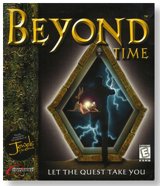
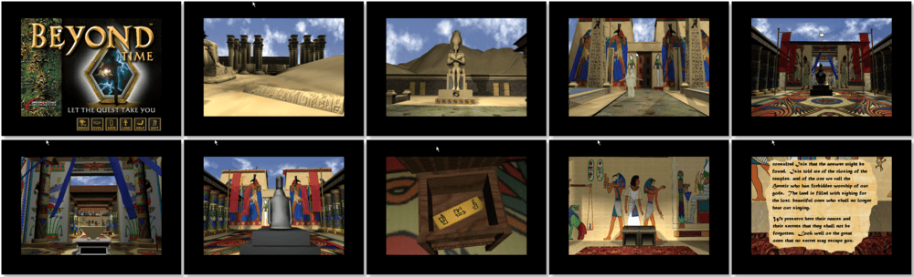

# Beyond Time

「**Shadow of the Obelisk**」「**Shadow of the Obelisk: Delve Into the Corridors of Time**」

> ❝ Step through the gateway into a 3D world of puzzles and adventure. Beyond the Mayan city, the Temple of Osiris, the Tibetan Palace, and the ruins of Atlantis. Explore every world and unlock the secrets to this fascinating mystery. The intrigue will guide you on an epic adventure. ❞
>

📌 ┃ **Year** ‣ 1997 ┃ **Genre** ‣ Adventure ┃ **Platform** ‣ Windows 3.1x ┃ **License** ‣ Abandonware ┃ **Media** ‣ CD-ROM 

📦 ┃ **[DOSBox](https://www.dosbox.com/) 🟩** ┃ **[DOSBox Staging](https://dosbox-staging.github.io/) 🟩** ┃ **[DOSBox-X](https://dosbox-x.com/) 🟩** 

📎 ┃ **[Wikipedia](https://en.wikipedia.org/wiki/Beyond_Time)** ┃ **[MobyGames](https://www.mobygames.com/game/5669/beyond-time/)** ┃ **Manual** ‣ [MyAbandonware 📄](https://www.myabandonware.com/game/beyond-time-dl5) 

## Installation Notes
- Use the default **drive** and **directory** for the installation location.
- Do not install *QuickTime*. Click **Exit** when prompted. Your Windows 3.1x has the most recent version.

## Additional Notes
- The `RUNEXIT.EXE` tool does not work with this program as it requires Windows 3.1x to be fully loaded.
  - Play the game by double-clicking **Beyond Time** icon.
- Mounted CD-ROM images at launch:
  1. Beyond Time Disc #1
  2. Beyond Time Disc #2

### How to swap CD-ROM images?
- [DOSBox](https://www.dosbox.com/wiki/DOSBox_FAQ#Swapping_CD_images) — Hotkey: CTRL+F4
- [DOSBox Staging](https://github.com/dosbox-staging/dosbox-staging/blob/main/README) — Hotkey: CTRL+F4 (or CMD+F4 on macOS)
- [DOSBox-X](https://dosbox-x.com/wiki/Guide%3AManaging-image-files-in-DOSBox%E2%80%90X#_mounting_multiple_cd_or_dvd_images) — Hotkey: F11+CTRL+C (or F12+D on macOS). Menu: DOS > Swap CD drive.

---

