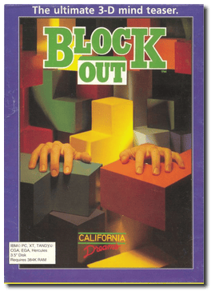
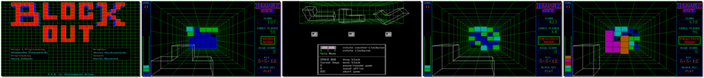

# Blockout

「**Block Out**」

> ❝ Sit back and get comfortable before you open this box. You'll begin with the playing pit, a 3-D enclosure with length, width, and depth that you can set. During the game, various 3-D blocks will fall. Rotate and maneuver each block into the proper position to form complete layers. As each layer completes, it vanishes, giving you more points and more room to work. Blockout will challenge your reflexes and resolve in a test of coordination and quick thinking. But the greatest challenge of all will be keeping yourself from playing it again, and again, and again. ❞
>
> ❝ Blockout is an unlicensed, 3D version of Tetris. ❞ — *Wikipedia*
>

📌 ┃ **Year** ‣ 1989 ┃ **Genre** ‣ Action • Puzzle ┃ **Platform** ‣ DOS ┃ **License** ‣ Freeware • Unlicensed ┃ **Category** ‣ Top-down • Falling block puzzle ┃ **Media** ‣ Floppy Disk ┃ **Copy Protection** 

📦 ┃ **[DOSBox](https://www.dosbox.com/) 🟩** ┃ **[DOSBox Staging](https://dosbox-staging.github.io/) 🟩** ┃ **[DOSBox-X](https://dosbox-x.com/) 🟩** 

📎 ┃ **[Wikipedia](https://en.wikipedia.org/wiki/Blockout)** ┃ **[MobyGames](https://www.mobygames.com/game/498/blockout/)** ┃ **[AbandonwareDOS](https://www.abandonwaredos.com/abandonware-game.php?abandonware=Blockout&gid=134)** ┃ **[MyAbandonware](https://www.myabandonware.com/game/blockout-ly)** 

## Installation Notes
- Select graphics mode: **EGA 640x350, 16 colors**.
- Consult `Assets/manual.pdf` for the game copy protection.

