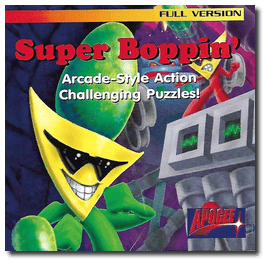
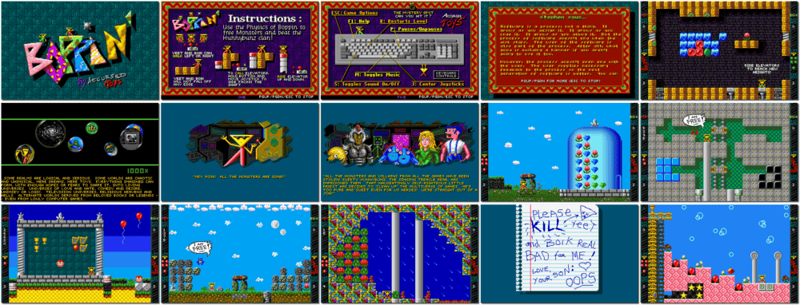

# Boppin'

「**Super Boppin'**」

> ❝ When all the monsters and villains in popular arcade video games mysteriously disappear, it's up to Yeet and Boik to free them to make games challenging again. Defeat the nauseatingly self-righteous Sweety Hunnybunz, a singing treacle bear that has them imprisoned. ❞
>
> ❝ The final release released on August 19, 2005 was freeware simply titled Boppin', had all the features of the third release and was the very release ported to Windows. ❞ — *Wikipedia*
>

📌 ┃ Year: **1994** ┃ Genre: **Puzzle** ┃ Platform: **DOS** ┃ License: **Freeware** ┃ Category: **Side view • Platform • Fantasy** ┃ Media: **Floppy Disk** ┃ **No Manual** 

📦 ┃ **[DOSBox](https://www.dosbox.com/) 🟩** ┃ **[DOSBox Staging](https://dosbox-staging.github.io/) 🟩** ┃ **[DOSBox-X](https://dosbox-x.com/) 🟩** 

📎 ┃ **[Wikipedia](https://en.wikipedia.org/wiki/Boppin%27)** ┃ **[MobyGames](https://www.mobygames.com/game/2570/boppin/)** ┃ **[AbandonwareDOS](https://www.abandonwaredos.com/abandonware-game.php?abandonware=Boppin&gid=1764)** ┃ **[MyAbandonware](https://www.myabandonware.com/game/boppin-1u7)** 

## Installation Notes
- Use the default **drive** and **directory** for the installation location.
- Please select which device you would like to use for sound fx: **SoundBlaster**.
- Please select the number of voices to use for sound effects mixing: **Eight Voices**.
- Please select the number of bits to use for sound effects mixing: **16 Bits (may improve quality)**.
- Please select which device you would like to use for music: **SoundBlaster**.

