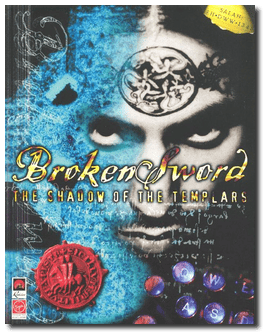
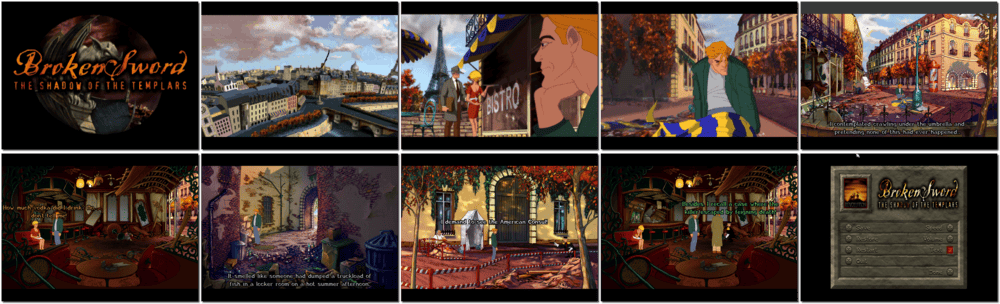

# Broken Sword: The Shadow of the Templars

「**Circle of Blood** (United States)」

> ❝ Uncover the identity of a jester assassin. Unlock the legend of the Knights Templar. Unravel a plot as twisted as the catacombs you will be wandering. As an American in Paris, George Stobbart, you find it odd when an accordion-playing clown darts out of a cafe clutching a briefcase. Moments later, a force of massive explosion sent you flying right into a sinister world of intrigue. What are the coveted contents of that briefcase? A fiercely guarded manuscript penned by a clandestine medieval order - the Knights Templar. Steal it back before a group of Megalomaniacs fathoms its mysteries and overturns the very balance of life. ❞
>
> ❝ This version is the original/legacy release for DOS. This game **is not abandonware 🚫** and a **Director's Cut** release is available on [GOG 💰](https://www.gog.com/en/game/broken_sword_directors_cut). ❞
>

📌 ┃ Year: **1996** ┃ Genre: **Adventure** ┃ Platform: **DOS** ┃ License: **Proprietary** ┃ Category: **Side view • Graphic adventure • Puzzle elements • Detective • Romance** ┃ Media: **CD-ROM** ┃ **Extra Command** 

📦 ┃ **[DOSBox](https://www.dosbox.com/) 🟩** ┃ **[DOSBox Staging](https://dosbox-staging.github.io/) 🟩** ┃ **[DOSBox-X](https://dosbox-x.com/) 🟩** 

📎 ┃ **[Wikipedia](https://en.wikipedia.org/wiki/Broken_Sword:_The_Shadow_of_the_Templars)** ┃ **[Wikipedia - Broken Sword Series](https://en.wikipedia.org/wiki/Broken_Sword)** ┃ **[Wikipedia - Broken Sword: Shadow of the Templars – The Director's Cut](https://en.wikipedia.org/wiki/Broken_Sword:_Shadow_of_the_Templars_%E2%80%93_The_Director%27s_Cut)** ┃ **[MobyGames](https://www.mobygames.com/game/499/circle-of-blood/)** ┃ **[AbandonwareDOS](https://www.abandonwaredos.com/abandonware-game.php?abandonware=Broken+Sword%3A+The+Shadow+of+the+Templars&gid=2332)** ┃ **[MyAbandonware](https://www.myabandonware.com/game/circle-of-blood-bok)** ┃ **[Broken Sword Fandom](https://brokensword.fandom.com/wiki/Broken_Sword:_The_Shadow_of_the_Templars)** ┃ The Director's Cut: **[GOG 💰](https://www.gog.com/en/game/broken_sword_directors_cut)** 

## Host Requirements
- The [mdf2iso](https://github.com/excitoon/mdf2iso) tool is required to convert MDF CD-ROM format to ISO.

## Installation Notes
- Sound Configuration Utility:
  - Select and configure digital audio driver: **Creative Labs Sound Blaster 16 or AWE32** (*Attempt to configure sound driver automatically*).
- Sequence Resolution: **High Resolution**.
- Use the default **drive** and **directory** for the installation location.
- Installation Type: **Full - 220MB**.

## Additional Notes
- Mounted CD-ROM images at launch:
  1. Broken Sword: The Shadow of the Templars Disc #1
  2. Broken Sword: The Shadow of the Templars Disc #2

### How to swap CD-ROM images?
- [DOSBox](https://www.dosbox.com/wiki/DOSBox_FAQ#Swapping_CD_images) — Hotkey: CTRL+F4
- [DOSBox Staging](https://github.com/dosbox-staging/dosbox-staging/blob/main/README) — Hotkey: CTRL+F4 (or CMD+F4 on macOS)
- [DOSBox-X](https://dosbox-x.com/wiki/Guide%3AManaging-image-files-in-DOSBox%E2%80%90X#_mounting_multiple_cd_or_dvd_images) — Hotkey: F11+CTRL+C (or F12+D on macOS). Menu: DOS > Swap CD drive.

```shell
if [[ ! -x "$(command -v mdf2iso)" ]]; then sdc__message__error "Missing mdf2iso."; exit 1; else true; fi
if [[ ! -f "./Assets/cdrom01.iso" ]]; then cd ./Assets && mdf2iso cdrom01.mdf; else true; fi
if [[ ! -f "./Assets/cdrom02.iso" ]]; then cd ./Assets && mdf2iso cdrom02.mdf; else true; fi
```



