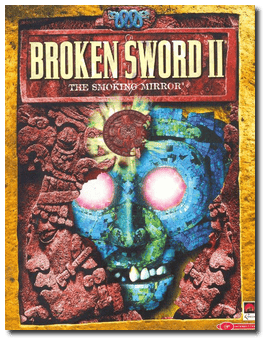
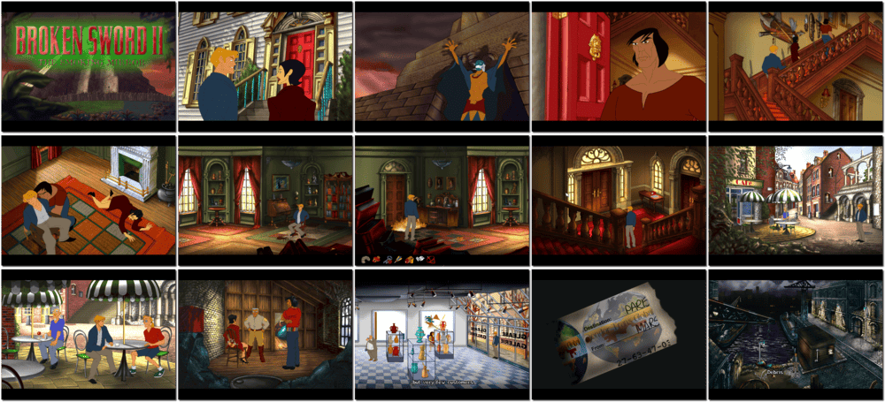

# Broken Sword II: The Smoking Mirror

「**Broken Sword: The Smoking Mirror**」「**Circle of Blood II**」「**Broken Sword 2**」

> ❝ Plunge into a shadowy conspiracy world where the schemes of a mad drug kingpin and the prophesized return of an ancient Mayan god clash in what could be the end of the world. Race around the globe with George as he frantically attempts to free Nico, his investigative reporter girlfriend, from the clutches of Karzac's crime cartel. Guide Nico and George as they unravel the dark mysteries that lead them closer and closer to an ancient horror best left buried in the steamy jungles of Central America. Gather clues and make friends, but beware - a smiling face can hide a deadly obstacle in your quest to stop the return of "he who devours the sun and consumes the flesh of all mankind", the mighty Mayan God, Tezcatlipoca. ❞
>
> ❝ This game **is not abandonware 🚫**. The **Remastered** release is available on [GOG 💰](https://www.gog.com/en/game/broken_sword_2__the_smoking_mirror) and [Steam 💰](https://store.steampowered.com/app/33600/Broken_Sword_2__the_Smoking_Mirror_Remastered/). ❞
>

📌 ┃ **Year** ‣ 1997 ┃ **Genre** ‣ Adventure ┃ **Platform** ‣ Windows 98SE ┃ **License** ‣ Proprietary ┃ **Category** ‣ 3rd-person • Graphic adventure • Puzzle elements • Contemporary • Europe • South America • Detective ┃ **Media** ‣ CD-ROM 

📦 ┃ **[DOSBox](https://www.dosbox.com/) ⬜ (untested)** ┃ **[DOSBox Staging](https://dosbox-staging.github.io/) ⬜ (untested)** ┃ **[DOSBox-X](https://dosbox-x.com/) 🟩** 

📎 ┃ **[Wikipedia](https://en.wikipedia.org/wiki/Broken_Sword_II:_The_Smoking_Mirror)** ┃ **[MobyGames](https://www.mobygames.com/game/1133/broken-sword-the-smoking-mirror/)** ┃ **[AbandonwareDOS](https://www.abandonwaredos.com/abandonware-game.php?abandonware=Broken+Sword+2%3A+The+Smoking+Mirror&gid=2924)** ┃ **[MyAbandonware](https://www.myabandonware.com/game/broken-sword-the-smoking-mirror-d3l)** ┃ **[Fandom](https://brokensword.fandom.com/wiki/Broken_Sword_II:_The_Smoking_Mirror)** ┃ **[Series](https://en.wikipedia.org/wiki/Broken_Sword)** ┃ **Remastered** ‣ [GOG 💰](https://www.gog.com/en/game/broken_sword_2__the_smoking_mirror) ┃ **Remastered** ‣ [Steam 💰](https://store.steampowered.com/app/33600/Broken_Sword_2__the_Smoking_Mirror_Remastered/) 

## Installation Notes
- Open *My Computer* and double-click on the `E:` CD-ROM drive to start the installation.
- Important points:
  - Use the default **drive** and **directory** for the installation location.
  - **DO NOT** install *DirectX* or *Direct Media* when prompted.
  - Always pick the largest installation size when prompted.

## Additional Notes
- The CPU *core* directive is currently set as `dynamic_x86` to [boost performance](https://dosbox-x.com/wiki/Guide%3AInstalling-Windows-98#_dynamic_vs_normal_core). It may impact Windows shut-down and restart processes. Switch it back to `normal` if you find an issue.
- Mounted CD-ROM images at launch:
  1. Broken Sword: The Smoking Mirror Disc #1
  2. Broken Sword: The Smoking Mirror Disc #2
- Swapping CD-ROM disc when multiple images are mounted: From DOSBox-X menu **DOS > Swap CD drive**.

