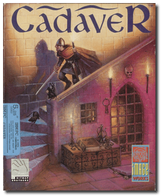
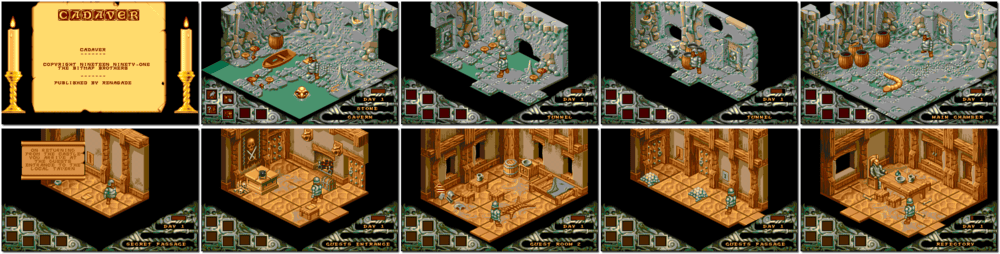

# Cadaver

「**Cadaver: The Payoff**」

> ❝ Karadoc, who is a gold-hungry dwarf and just hopes to find a treasure, is on a mission to seek out and kill the necromancer Dianos, the sole remaining inhabitant of Castle Wulf. ❞ — *Cadaver*
>
> ❝ Dianos is dead. Karadoc has fulfilled The Cadaver contract. But collecting the reward will be more challenging than you had ever imagined. ❞ — *Cadaver: The Payoff*
>

📌 ┃ **Year** ‣ 1990 ┃ **Year (The Payoff)** ‣ 1991 ┃ **Genre** ‣ Action ┃ **Platform** ‣ DOS ┃ **License** ‣ Abandonware ┃ **Media** ‣ Floppy Disk ┃ **Add-on** 

📦 ┃ **[DOSBox](https://www.dosbox.com/) 🟩** ┃ **[DOSBox Staging](https://dosbox-staging.github.io/) 🟩** ┃ **[DOSBox-X](https://dosbox-x.com/) 🟩** 

📎 ┃ **Cadaver** ‣ [Wikipedia](https://en.wikipedia.org/wiki/Cadaver_(video_game)) • [MobyGames](https://www.mobygames.com/game/1980/cadaver/) • [MyAbandonware](https://www.myabandonware.com/game/cadaver-13x) ┃ **Cadaver: The Payoff** ‣ [MobyGames](https://www.mobygames.com/game/10198/cadaver-the-payoff/) • [MyAbandonware](https://www.myabandonware.com/game/cadaver-the-payoff-258) ┃ **[OldGames.sk - Cadaver Secret Shrine](https://www.oldgames.sk/docs/cadaver/index.php)** 

## Installation Notes
- Audio options: **Sound Blaster**.
- Video options: **Colour VGA**.
- Control method: *Configure the control keys here*.
- Hard disk install:
  - Install from drive A? Press `Y`.
  - Copy files to drive C? Press `Y`.
  - Copy to what directory? Type in **`\CADAVER`** as the installation path and press `ENTER`.
  - Install to directory `C:\CADAVER`? Press `Y`.
  - Install now? Press `Y`.
  - Save setup? Press `Y`.

---

