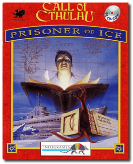
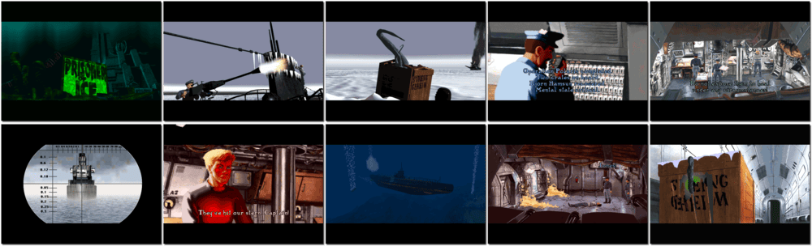

# Call of Cthulhu: Prisoner of Ice

「**Prisoner of Ice**」

> ❝ Board the H.M.S. Victoria for a voyage to places beyond your wildest imagination! From the icy wastelands of Antarctica to secret German military camps and espionage in Buenos Aires, this supernatural action-adventure will pique your obsession with horror and intrigue. You are in charge of your destiny but beware - the twisted events of your voyage will take you to task at every turn. Take the risk. Teleport yourself across the globe to a Socerers cave, unleash the secrets of aliens frozen in ice or solve the case of smuggled Top Secret cargo. Prepare to face the most chilling adventure on ice. Remember, you are one step ahead of capture, one step behind horror! ❞
>
> ❝ This game **is not abandonware 🚫** and is still for sale on [GOG 💰](https://gog.com/en/game/call_of_cthulhu_prisoner_of_ice) and [Steam 💰](https://store.steampowered.com/app/359620/Call_of_Cthulhu_Prisoner_of_Ice/). ❞
>

📌 ┃ **Year** ‣ 1995 ┃ **Genre** ‣ Adventure ┃ **Platform** ‣ DOS ┃ **License** ‣ Proprietary ┃ **Category** ‣ 3rd-person • Graphic adventure • Puzzle elements • Interwar • Horror ┃ **Media** ‣ Compressed Package 

📦 ┃ **[DOSBox](https://www.dosbox.com/) 🟩** ┃ **[DOSBox Staging](https://dosbox-staging.github.io/) 🟩** ┃ **[DOSBox-X](https://dosbox-x.com/) 🟩** 

📎 ┃ **[Wikipedia](https://en.wikipedia.org/wiki/Prisoner_of_Ice)** ┃ **[MobyGames](https://www.mobygames.com/game/376/prisoner-of-ice/)** ┃ **[AbandonwareDOS](https://www.abandonwaredos.com/abandonware-game.php?abandonware=Prisoner+of+Ice&gid=1554)** ┃ **[MyAbandonware](https://www.myabandonware.com/game/prisoner-of-ice-32x)** ┃ **Manual** ‣ [Games Database](https://www.gamesdatabase.org/game/microsoft-dos/prisoner-of-ice) ┃ **[GOG 💰](https://gog.com/en/game/call_of_cthulhu_prisoner_of_ice)** ┃ **[Steam 💰](https://store.steampowered.com/app/359620/Call_of_Cthulhu_Prisoner_of_Ice/)** 

## Host Requirements
- The **unzip** tool is required to extract the compressed package.

## Installation Notes
- Use the default **drive** and **directory** for the installation location.
- Sound effects card configuration: **SB16**; Port: **220**; IRQ: **7**; DMA: **1** - *Test sound effects*.
- Configure music card: **SB Pro/16** - *Test music*.
- *Save and start-up game*.

```shell
if [[ ! -x "$(command -v unzip)" ]]; then sdc__message__error "Missing unzip."; exit 1; else true; fi
if [[ ! -f "Assets/pice/cd-us/ice640.exe" ]]; then cd ./Assets && unzip game.zip; else true; fi
```



