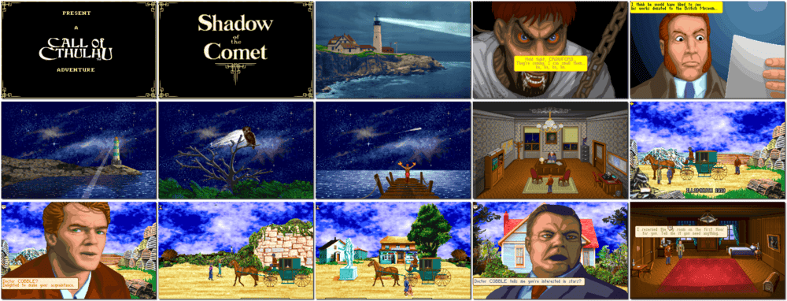

# Call of Cthulhu: Shadow of the Comet

「**Shadow of the Comet**」

> ❝ The year is 1910. Bathed in pale Spring sunlight, the small fishing port of Illsmouth is a sleepy New England town where time seems to stand still. Appearances can be very deceiving, however. Beneath the peaceful tranquillity of this small village, a horrifying truth lingers. Whispers in a dusty, secluded library ripple with fear as questions of the past into the present. Is there a link between the return of Halley Comet and the resurgence of the Great Ancients who once dominated the land in a reign of terror? Legend tells tales of an ancient ritual ground, hidden deep in the shadows of the tangled forest, marked by an ornate and mysterious cross. Once, long ago, this site was the stage for wild and terrifying rites that no one speaks of, lest they suffer the wrath of the Ancients. ❞
>
> ❝ This game **is not abandonware 🚫** and is still for sale on [GOG 💰](https://www.gog.com/en/game/call_of_cthulhu_shadow_of_the_comet) and [Steam 💰](https://store.steampowered.com/app/389470/Call_of_Cthulhu_Shadow_of_the_Comet/). ❞
>

📌 ┃ **Year** ‣ 1993 ┃ **Genre** ‣ Adventure ┃ **Platform** ‣ DOS ┃ **License** ‣ Proprietary ┃ **Category** ‣ Side view • Graphic adventure • Puzzle elements • Horror ┃ **Media** ‣ CD-ROM 

📦 ┃ **[DOSBox](https://www.dosbox.com/) 🟩** ┃ **[DOSBox Staging](https://dosbox-staging.github.io/) 🟩** ┃ **[DOSBox-X](https://dosbox-x.com/) 🟩** 

📎 ┃ **[Wikipedia](https://en.wikipedia.org/wiki/Shadow_of_the_Comet)** ┃ **[MobyGames](https://www.mobygames.com/game/132/call-of-cthulhu-shadow-of-the-comet/)** ┃ **[AbandonwareDOS](https://www.abandonwaredos.com/abandonware-game.php?abandonware=Shadow+of+the+Comet&gid=2866)** ┃ **[MyAbandonware](https://www.myabandonware.com/game/call-of-cthulhu-shadow-of-the-comet-21v)** ┃ **Manual** ‣ [Games Database](https://www.gamesdatabase.org/game/microsoft-dos/call-of-cthulu-shadow-of-the-comet) ┃ **[GOG 💰](https://www.gog.com/en/game/call_of_cthulhu_shadow_of_the_comet)** ┃ **[Steam 💰](https://store.steampowered.com/app/389470/Call_of_Cthulhu_Shadow_of_the_Comet/)** 

## Installation Notes
- Select *language* and then **Install**.
- Use the default **drive** and **directory** for the installation location.

