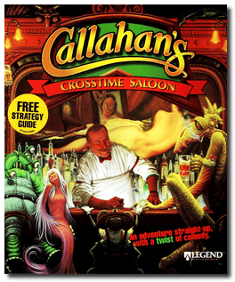
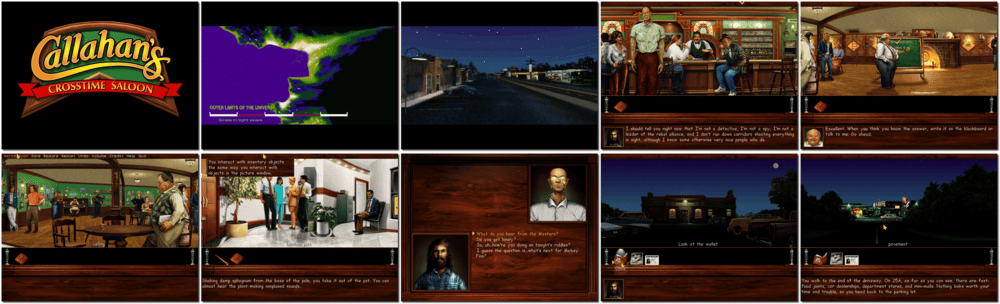

# Callahan's Crosstime Saloon

> ❝ The Gods have decided that our very Universe is closing. The regulars in Callahan's Crosstime Saloon can either drink up and go home or do something about it. But Callahan's is no ordinary neighbourhood bar. Think of it as a cross between Cheers and the Star Wars Cantina. It is where every being knows your name, even if you are from another time or another universe. ❞
>

📌 ┃ **Year** ‣ 1997 ┃ **Genre** ‣ Adventure ┃ **Platform** ‣ DOS ┃ **License** ‣ Abandonware ┃ **Media** ‣ CD-ROM ┃ **Patched** ‣ 1.0.1 

📦 ┃ **[DOSBox](https://www.dosbox.com/) 🟩** ┃ **[DOSBox Staging](https://dosbox-staging.github.io/) 🟩** ┃ **[DOSBox-X](https://dosbox-x.com/) 🟩** 

📎 ┃ **[Wikipedia](https://en.wikipedia.org/wiki/Callahan%27s_Crosstime_Saloon_(video_game))** ┃ **[MobyGames](https://www.mobygames.com/game/2150/callahans-crosstime-saloon/)** ┃ **[MyAbandonware](https://www.myabandonware.com/game/callahan-s-crosstime-saloon-a1d)** 

## Installation Notes
- Installation Options: **Optimum Performance Installation**.
- Use the default **drive** and **directory** for the installation location.
- Sound Configuration Options:
  - Select and configure MIDI music driver: **Creative Labs Sound Blaster(TM) 16** (*Attempt to configure sound driver automatically*).
  - Select and configure digital audio driver: **Creative Labs Sound Blaster 16 or AWE32** (*Attempt to configure sound driver automatically*).

---

