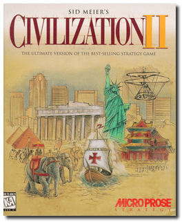
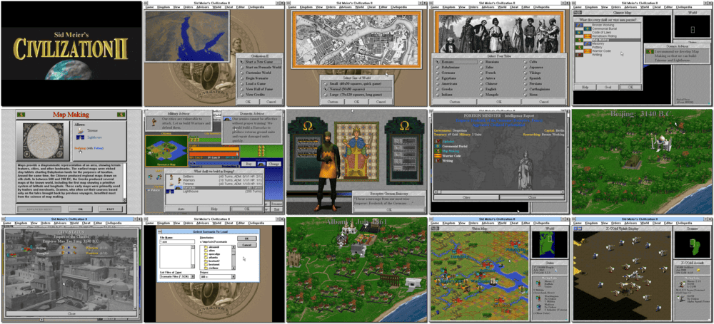

# Civilization II

「**Sid Meier's Civilization II**」「**Civilization 2000**」「**Civilization II: Conflicts in Civilization**」「**Civilization II: Fantastic Worlds**」

> ❝ Introducing: Sid Meier's Civilization II. Make every critical social, economic and political decision as you build an empire to stand the test of time. Compete against some of the great leaders of all time. It's discovery. It's diplomacy. It's your destiny. So plan your every move carefully. ❞
>

📌 ┃ **Year** ‣ 1996 ┃ **Year (Conflicts in Civilization)** ‣ 1996 ┃ **Year (Fantastic Worlds)** ‣ 1997 ┃ **Genre** ‣ Strategy ┃ **Platform** ‣ Windows 3.1x ┃ **License** ‣ Abandonware ┃ **Category** ‣ Diagonal-down • Turn-based • 4X • Managerial • Turn-based strategy • Historical events • Post-apocalyptic • Sci-fi • Fantasy • Steampunk ┃ **Media** ‣ CD-ROM ┃ **Compilation** 

📦 ┃ **[DOSBox](https://www.dosbox.com/) 🟩** ┃ **[DOSBox Staging](https://dosbox-staging.github.io/) 🟩** ┃ **[DOSBox-X](https://dosbox-x.com/) 🟩** 

📎 ┃ **Civilization II** ‣ [Wikipedia](https://en.wikipedia.org/wiki/Civilization_II) • [MobyGames](https://www.mobygames.com/game/15/sid-meiers-civilization-ii/) • [AbandonwareDOS](https://www.abandonwaredos.com/abandonware-game.php?abandonware=Civilization+2&gid=1894) • [MyAbandonware](https://www.myabandonware.com/game/sid-meier-s-civilization-ii-453) • [Civilization Fandom](https://civilization.fandom.com/wiki/Civilization_II) ┃ **Civilization II: Conflicts in Civilization** ‣ [Wikipedia](https://en.wikipedia.org/wiki/Civilization_II:_Conflicts_in_Civilization) • [MobyGames](https://www.mobygames.com/game/1509/sid-meiers-civilization-ii-scenarios-conflicts-in-civilization/) • [MyAbandonware](https://www.myabandonware.com/game/sid-meier-s-civilization-ii-scenarios-conflicts-in-civilization-c45) • [Civilization Fandom](https://civilization.fandom.com/wiki/Civilization_II:_Conflicts_in_Civilization) ┃ **Civilization II: Fantastic Worlds** ‣ [MobyGames](https://www.mobygames.com/game/1593/civilization-ii-fantastic-worlds/) • [MyAbandonware](https://www.myabandonware.com/game/civilization-ii-fantastic-worlds-dvr) • [Civilization Fandom](https://civilization.fandom.com/wiki/Civ_II:_Fantastic_Worlds) ┃ **[Wikipedia - Civilization Series](https://en.wikipedia.org/wiki/Civilization_(series))** 

## Installation Notes
- Use the default **drive** and **directory** for the installation location.
  - Select **Full Install**.
- Install **Video for Windows 1.1e** when prompted. It adds Indeo interactive features to the existing Video for Windows runtime.
- Install both **Conflicts in Civilization** and **Fantastic Worlds** add-ons. Open **Main > File Manager** and go to the `E:` drive. Double-click on each of these filenames listed:
  - `E:\CIVSCEN\SETUP.EXE` to install *Civilization II: Conflicts in Civilization*.
  - `E:\CIVFANT\SETUP.EXE` to install *Civilization II: Fantastic Worlds*.
- Exit Windows and DOSBox once the installation is complete (**Program Manager > File > Exit Windows**) and rerun the `Launch` script to start the program.

## Additional Notes
- When starting the game for the first time, select **Turn ON Heralds. I have at least 16 megabytes of RAM.**

### How to play this game on a larger display resolution?
- Select **2. Run Windows Setup** at program start-up.
- Change **Display** settings to _**S3 ... [width]x[height] 256 colors SF.**_
  - Replace *[width]x[height]* with your desired screen resolution, e.g. 800x600 or 1024x768.
  - Only select a display option that ends with *256 colors SF* as it is the most widely used format in games.
- Accept the configuration shown above.
- Press `ENTER` when prompted to **Keep Driver**.

