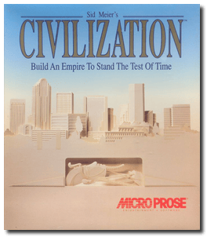
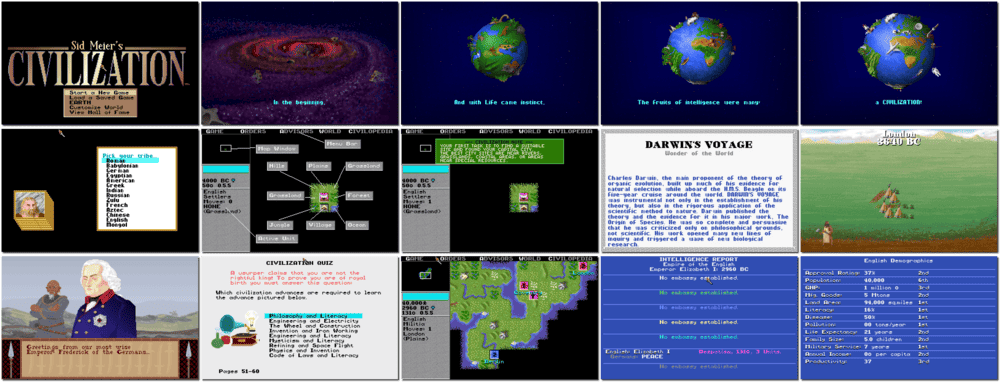

# Sid Meier's Civilization

「**Civilization**」「**Sid Meier's Civilization: Build an Empire to Stand the Test of Time**」

> ❝ High in the Andes, a biting wind howls through the Incas' ruined strongholds. Half a world away, the Pharaohs' tombs lie empty. In Italy, the Roman Colosseum decays. Everywhere, you see remnants of societies that thought they would endure forever. All are dust. But yours could be different. You could be the person in history who builds an empire that never falls. ❞
>

📌 ┃ **Year** ‣ 1991 ┃ **Genre** ‣ Strategy ┃ **Platform** ‣ DOS ┃ **License** ‣ Abandonware ┃ **Media** ‣ Compressed Package ┃ **Patched** ‣ 474.05 ┃ **Copy Protection** 

📦 ┃ **[DOSBox](https://www.dosbox.com/) 🟩** ┃ **[DOSBox Staging](https://dosbox-staging.github.io/) 🟩** ┃ **[DOSBox-X](https://dosbox-x.com/) 🟩** 

📎 ┃ **[Wikipedia](https://en.wikipedia.org/wiki/Civilization_(video_game))** ┃ **[MobyGames](https://www.mobygames.com/game/585/sid-meiers-civilization/)** ┃ **[MyAbandonware](https://www.myabandonware.com/game/sid-meier-s-civilization-1nj)** ┃ **[Series](https://en.wikipedia.org/wiki/Civilization_(series))** 

## Additional Notes
- Starting the game:
  - Select graphics mode: **1) VGA (256 color)**.
  - Select sound mode: **4) AdLib/Sound Blaster**.
  - **1) Mouse and Keyboard**.
- Consult `Assets/manual.pdf` for the game copy protection.

---

