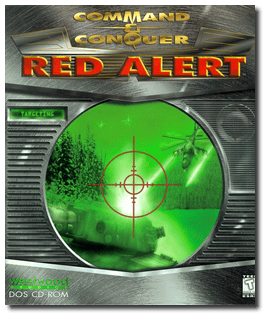
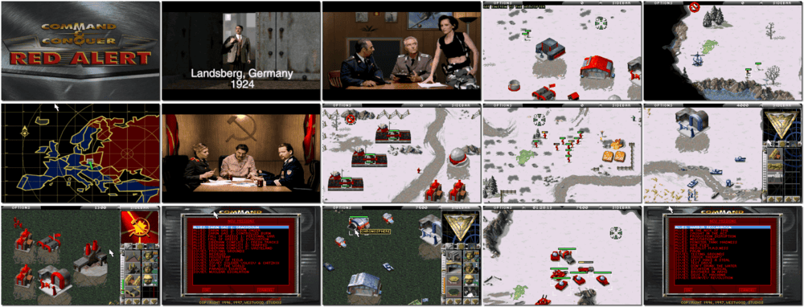

# Command & Conquer: Red Alert

「**Red Alert** (Base)」「**Red Alert - Counterstrike** (Add-on)」「**Red Alert - The Aftermath** (Add-on)」

> ❝ Dark experiments have permanently altered time. Or have they? Now, Soviet tanks crush city after city while Allied cruisers shell bases. Spies lurk, land mines wait, and strange new technologies aid both sides in their struggle for ultimate control. ❞
>
> ❝ To mark the 13th anniversary of Command and Conquer and the announcement of Red Alert 3, EA released Command and Conquer: Red Alert as freeware. ❞ — *Wikipedia*
>

📌 ┃ **Year (Red Alert)** ‣ 1996 ┃ **Year (Red Alert - Counterstrike)** ‣ 1997 ┃ **Year (Red Alert - The Aftermath)** ‣ 1997 ┃ **Genre** ‣ Strategy ┃ **Platform** ‣ DOS ┃ **License** ‣ Freeware ┃ **Media** ‣ CD-ROM ┃ **Patched** ‣ Red Alert - The Aftermath mission bugfix ┃ **Add-on** 

📦 ┃ **[DOSBox](https://www.dosbox.com/) 🟩** ┃ **[DOSBox Staging](https://dosbox-staging.github.io/) 🟩** ┃ **[DOSBox-X](https://dosbox-x.com/) 🟩** 

📎 ┃ **Red Alert** ‣ [Wikipedia](https://en.wikipedia.org/wiki/Command_%26_Conquer:_Red_Alert) • [MobyGames](https://www.mobygames.com/game/485/command-conquer-red-alert/) • [MyAbandonware](https://www.myabandonware.com/game/command-conquer-red-alert-7pi) ┃ **Red Alert - Counterstrike** ‣ [MobyGames](https://www.mobygames.com/game/863/command-conquer-red-alert-counterstrike/) • [MyAbandonware](https://www.myabandonware.com/game/command-conquer-red-alert-counterstrike-7pk) ┃ **Red Alert - The Aftermath** ‣ [MobyGames](https://www.mobygames.com/game/866/command-conquer-red-alert-the-aftermath/) • [MyAbandonware](https://www.myabandonware.com/game/command-conquer-red-alert-the-aftermath-7pj) ┃ **[Series](https://en.wikipedia.org/wiki/Command_%26_Conquer)** ┃ **Remastered Collection** ‣ [Steam 💰](https://store.steampowered.com/app/1213210/Command__Conquer_Remastered_Collection/) 

## Installation Notes
- Installing **Command & Conquer: Red Alert**:
  - Select Vocal & Sound Communication: **SND BLASTER ASP/16/AWE-32**.
  - Confirm and Test Port: **220**, IRQ: **7**, and DMA: **5**.
  - Use the default **drive** and **directory** for the installation location.
  - **IMPORTANT:** Installation may crash at the *PLEASE STANDBY...* screen. Force quit DOSBox and relaunch to continue the next step.
- Installing **Command & Conquer: Red Alert - Counterstrike**:
  - Use the default **drive** and **directory** for the installation location.
- Installing **Command & Conquer: Red Alert - The Aftermath**:
  - Use the default **drive** and **directory** for the installation location.

## Additional Notes
- CD-ROM images will be mounted based on the selected game:
  1. Command & Conquer: Red Alert Disc #1 (Allied) and  Disc #2 (Soviet)
  2. Command & Conquer: Red Alert - Counterstrike (New Missions)
  3. Command & Conquer: Red Alert - The Aftermath (New Missions)

### How to swap CD-ROM images?
- [DOSBox](https://www.dosbox.com/wiki/DOSBox_FAQ#Swapping_CD_images) — Hotkey: CTRL+F4
- [DOSBox Staging](https://github.com/dosbox-staging/dosbox-staging/blob/main/README) — Hotkey: CTRL+F4 (or CMD+F4 on macOS)
- [DOSBox-X](https://dosbox-x.com/wiki/Guide%3AManaging-image-files-in-DOSBox%E2%80%90X#_mounting_multiple_cd_or_dvd_images) — Hotkey: F11+CTRL+C (or F12+D on macOS). Menu: DOS ‣ Swap CD drive.

---

