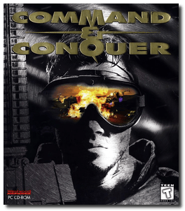
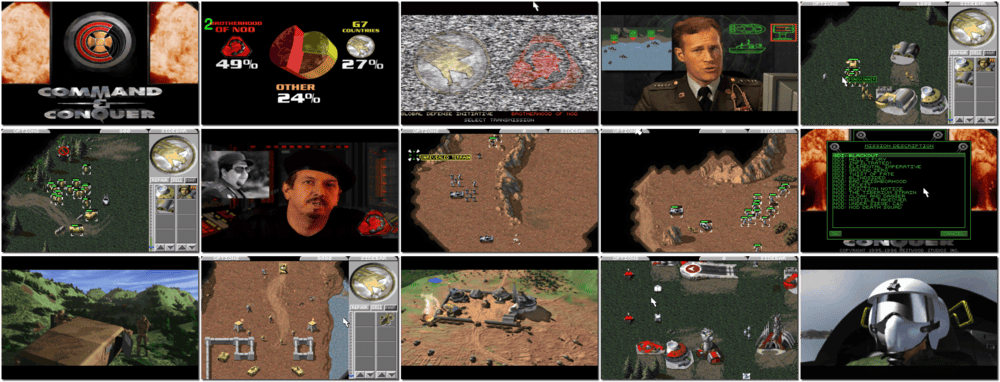

# Command & Conquer

「**Command & Conquer: Tiberian Dawn**」「**C&C**」「**Command & Conquer: The Covert Operations**」「**C&C:CO**」

> ❝ Welcome to the New World Order. A gritty high-tech world where the art of electronic intelligence and covert surveillance reigns supreme. Guerrilla strategies and savage combat are the norms. In the hyper-real combat/strategy experience of Command & Conquer, you're thrust dead-on into the heat of an all-out race for global control. Will you side with the humanistic Global Defense Initiative? Or bring the world to its knees with the terroristic Brotherhood of Nod? Decide fast. Your adversaries are without mercy. Spread your web of power via electronic and physical aggression. Build bases, muster forces and lacerate your enemies to the bone. All for the love of power. ❞
>
> ❝ To mark the 12th anniversary of the franchise, Electronic Arts, the current publisher and owner of the series, released the game for free in 2007. ❞ — *Wikipedia*
>

📌 ┃ Year: **1995** ┃ Year: **1996 (The Covert Operations)** ┃ Genre: **Strategy** ┃ Platform: **DOS** ┃ License: **Freeware** ┃ Category: **Diagonal-down • Real-time • Real-time strategy • Africa • Europe • Sci-fi • War** ┃ Media: **CD-ROM** ┃ **Compilation** 

📦 ┃ **[DOSBox](https://www.dosbox.com/) 🟩** ┃ **[DOSBox Staging](https://dosbox-staging.github.io/) 🟩** ┃ **[DOSBox-X](https://dosbox-x.com/) 🟩** 

📎 ┃ **[Wikipedia](https://en.wikipedia.org/wiki/Command_%26_Conquer_(1995_video_game))** ┃ **[Wikipedia - Command & Conquer Series](https://en.wikipedia.org/wiki/Command_%26_Conquer)** ┃ **[MobyGames - Command & Conquer](https://www.mobygames.com/game/338/command-conquer/)** ┃ **[MobyGames - Command & Conquer: The Covert Operations](https://www.mobygames.com/game/883/command-conquer-the-covert-operations/)** ┃ **[AbandonwareDOS](https://www.abandonwaredos.com/abandonware-game.php?abandonware=Command+%26amp%3B+Conquer&gid=2345)** ┃ **[MyAbandonware - Command & Conquer](https://www.myabandonware.com/game/command-conquer-2r7)** ┃ **[MyAbandonware - Command & Conquer: The Covert Operations](https://www.myabandonware.com/game/command-conquer-the-covert-operations-arg)** ┃ **[Command & Conquer Fandom - Command & Conquer](https://cnc.fandom.com/wiki/Command_%26_Conquer_(1995))** ┃ **[Command & Conquer Fandom - Command & Conquer: The Covert Operations](https://cnc.fandom.com/wiki/Command_%26_Conquer:_The_Covert_Operations)** ┃ Remastered Collection: **[Steam 💰](https://store.steampowered.com/app/1213210/Command__Conquer_Remastered_Collection/)** 

## Installation Notes
- Installing **Command & Conquer**:
  - Select E.V.A.'s Vocal & Sound Communication: **SND BLASTER ASP/16/AWE-32**.
  - Confirm and Test Port: **220**, IRQ: **7**, and DMA: **5**.
  - Use the default **drive** and **directory** for the installation location.
- Installing **Command & Conquer: The Covert Operations**:
  - Use the default **drive** and **directory** for the installation location.

## Additional Notes
- CD-ROM images will be mounted based on the selected game:
  1. Command & Conquer Disc #1 (GDI) and Disc #2 (Nod)
  2. Command & Conquer: The Covert Operations (New Missions)

### How to swap CD-ROM images?
- [DOSBox](https://www.dosbox.com/wiki/DOSBox_FAQ#Swapping_CD_images) — Hotkey: CTRL+F4
- [DOSBox Staging](https://github.com/dosbox-staging/dosbox-staging/blob/main/README) — Hotkey: CTRL+F4 (or CMD+F4 on macOS)
- [DOSBox-X](https://dosbox-x.com/wiki/Guide%3AManaging-image-files-in-DOSBox%E2%80%90X#_mounting_multiple_cd_or_dvd_images) — Hotkey: F11+CTRL+C (or F12+D on macOS). Menu: DOS > Swap CD drive.

