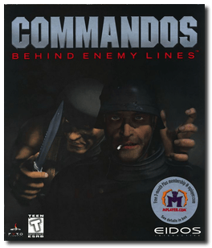
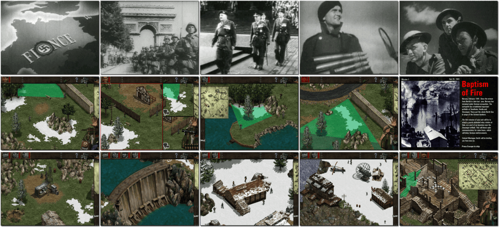

# Commandos: Behind Enemy Lines

「**Commandos**」

> ❝ Engage in the ultimate battle of wits and wills, commanding the ruthless military force in history. Set in the backdrop of WWII, Commandos is a real-time tactical wargame that puts you in command of a squad of elite Allied Commandos whose job is to complete 24 dangerous missions behind enemy lines. Intercept the German war effort using sabotage and tactical genius. ❞
>
> ❝ This game **is not abandonware 🚫** and is still for sale on [Steam 💰](https://store.steampowered.com/app/6800/Commandos_Behind_Enemy_Lines/) and [Zoom 💰](https://www.zoom-platform.com/product/commandos-behind-enemy-lines). The **Commandos Ammo Pack** release is available on [GOG 💰](https://www.gog.com/en/game/commandos_ammo_pack). ❞
>

📌 ┃ **Year** ‣ 1998 ┃ **Genre** ‣ Strategy ┃ **Platform** ‣ Windows 98SE ┃ **License** ‣ Proprietary ┃ **Category** ‣ Diagonal-down • Real-time • Real-time tactics • Stealth • Africa • Europe • Historical events • World War II • War ┃ **Media** ‣ CD-ROM 

📦 ┃ **[DOSBox](https://www.dosbox.com/) ⬜ (untested)** ┃ **[DOSBox Staging](https://dosbox-staging.github.io/) ⬜ (untested)** ┃ **[DOSBox-X](https://dosbox-x.com/) 🟩** 

📎 ┃ **[Wikipedia](https://en.wikipedia.org/wiki/Commandos:_Behind_Enemy_Lines)** ┃ **[MobyGames](https://www.mobygames.com/game/976/commandos-behind-enemy-lines/)** ┃ **[AbandonwareDOS](https://www.abandonwaredos.com/abandonware-game.php?abandonware=Commandos%3A+Behind+Enemy+Lines&gid=2415)** ┃ **[MyAbandonware](https://www.myabandonware.com/game/commandos-behind-enemy-lines-d4i)** ┃ **[Fandom](https://commandos.fandom.com/wiki/Commandos:_Behind_Enemy_Lines)** ┃ **[Series](https://en.wikipedia.org/wiki/Commandos_(series))** ┃ **[Steam 💰](https://store.steampowered.com/app/6800/Commandos_Behind_Enemy_Lines/)** ┃ **[Zoom 💰](https://www.zoom-platform.com/product/commandos-behind-enemy-lines)** ┃ **Commandos Ammo Pack** ‣ [GOG 💰](https://www.gog.com/en/game/commandos_ammo_pack) 

## Installation Notes
- Open *My Computer* and double-click on the `E:` CD-ROM drive to start the installation.
- Important points:
  - Use the default **drive** and **directory** for the installation location.
  - **DO NOT** install *DirectX* or *Direct Media* when prompted.
  - Always pick the largest installation size when prompted.

## Additional Notes
- The CPU *core* directive is currently set as `dynamic_x86` to [boost performance](https://dosbox-x.com/wiki/Guide%3AInstalling-Windows-98#_dynamic_vs_normal_core). It may impact Windows shut-down and restart processes. Switch it back to `normal` if you find an issue.

