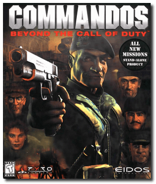
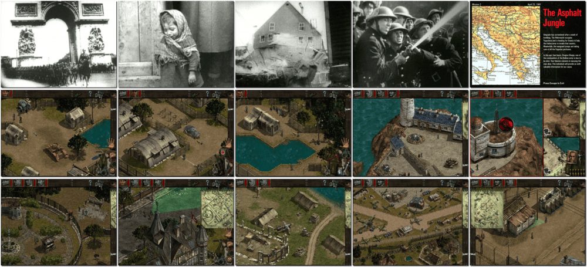

# Commandos: Beyond the Call of Duty

> ❝ You now mobilise in a series of eight new dangerous missions. You may come with experience of action "Behind Enemy Lines", or perhaps you are a rookie. You will have the opportunity to push your daring and tactical ability to the limit. As the leader of a small elite unit operating deep within enemy territory, you will experience new challenges and goals within these new missions. ❞
>
> ❝ This game **is not abandonware 🚫** and is still for sale on [Steam 💰](https://store.steampowered.com/app/6810/Commandos_Beyond_the_Call_of_Duty/) and [Zoom 💰](https://www.zoom-platform.com/product/commandos-beyond-the-call-of-duty). The **Commandos Ammo Pack** release is available on [GOG 💰](https://www.gog.com/en/game/commandos_ammo_pack). ❞
>

📌 ┃ **Year** ‣ 1999 ┃ **Genre** ‣ Strategy ┃ **Platform** ‣ Windows 9x ┃ **License** ‣ Proprietary ┃ **Media** ‣ CD-ROM 

📦 ┃ **[DOSBox](https://www.dosbox.com/) ⬜ • Untested** ┃ **[DOSBox Staging](https://dosbox-staging.github.io/) ⬜ • Untested** ┃ **[DOSBox-X](https://dosbox-x.com/) 🟩** 

📎 ┃ **[Wikipedia](https://en.wikipedia.org/wiki/Commandos:_Behind_Enemy_Lines#Expansion)** ┃ **[MobyGames](https://www.mobygames.com/game/978/commandos-beyond-the-call-of-duty/)** ┃ **[MyAbandonware](https://www.myabandonware.com/game/commandos-beyond-the-call-of-duty-d4j)** ┃ **[Fandom](https://commandos.fandom.com/wiki/Commandos:_Beyond_the_Call_of_Duty)** ┃ **[Series](https://en.wikipedia.org/wiki/Commandos_(series))** ┃ **[Steam 💰](https://store.steampowered.com/app/6810/Commandos_Beyond_the_Call_of_Duty/)** ┃ **[Zoom 💰](https://www.zoom-platform.com/product/commandos-beyond-the-call-of-duty)** ┃ **Commandos Ammo Pack** ‣ [GOG 💰](https://www.gog.com/en/game/commandos_ammo_pack) 

## Installation Notes
- Open *My Computer* and double-click on the `D:` CD-ROM drive to start the installation.
- Use the default **drive** and **directory** for the installation location.
- **DO NOT** install *DirectX* or *Direct Media* when prompted.
- Select the largest installation size when prompted.

---

