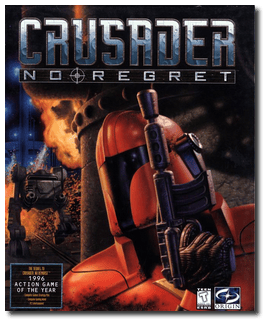

# Crusader: No Regret

「**Crusader: No Regret - The Next Chapter**」

> ❝ You're a renegade, Silencer, out to settle a score with the powerful World Economic Consortium. Only your instincts, agility and firepower can get you through in one piece to the ultimate confrontation with your greatest enemy. ❞
>
> ❝ This game **is not abandonware 🚫** and is still for sale on [GOG 💰](https://gog.com/en/game/crusader_no_regret). ❞
>

📌 ┃ **Year** ‣ 1996 ┃ **Genre** ‣ Action ┃ **Platform** ‣ DOS ┃ **License** ‣ Proprietary ┃ **Category** ‣ Diagonal-down • Shooter • Sci-fi ┃ **Media** ‣ CD-ROM 

📦 ┃ **[DOSBox](https://www.dosbox.com/) 🟩** ┃ **[DOSBox Staging](https://dosbox-staging.github.io/) 🟩** ┃ **[DOSBox-X](https://dosbox-x.com/) 🟩** 

📎 ┃ **[Wikipedia](https://en.wikipedia.org/wiki/Crusader:_No_Regret)** ┃ **[MobyGames](https://www.mobygames.com/game/852/crusader-no-regret/)** ┃ **[AbandonwareDOS](https://www.abandonwaredos.com/abandonware-game.php?abandonware=Crusader%3A+No+Regret&gid=1721)** ┃ **[MyAbandonware](https://www.myabandonware.com/game/crusader-no-regret-bpn)** ┃ **[GOG 💰](https://gog.com/en/game/crusader_no_regret)** ┃ **Manual** ‣ [Games Database](https://www.gamesdatabase.org/game/microsoft-dos/crusader-no-regret) 

## Installation Notes
- Use the default **drive** and **directory** for the installation location.
  - Would you like to change the destination path? **No**.
- Would you like digital sound effects: **Yes**.
  - Please select sound card: **Sound Blaster 16/AWE 32**.
  - Please select port: **0x220**.
  - Please select IRQ: **7**.
  - Please select DMA: **5**.
- Select control type: **Keyboard/Mouse**.
- Would you like subtitles: **Yes**.
- Would you like to have 16-bit color video: **Yes**.
- Please choose video size: **Large Video**.
- Select **Continue installation**.

