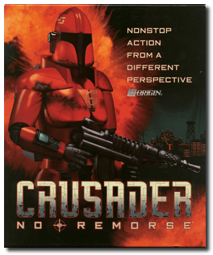
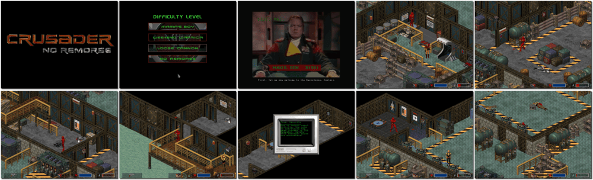

# Crusader: No Remorse

> ❝ As a Silencer, one of the elite enforcers of the World Economic Consortium, you're supposed to be incorruptible. But if the system you serve is utterly corrupt, where does that leave you? You go to the Resistance, the same pack you used to hunt down. Your former employers better watch their backs because you're coming after them with all the firepower at your command - No pity, no mercy, no remorse. ❞
>
> ❝ This game **is not abandonware 🚫** and is still for sale on [GOG 💰](https://www.gog.com/en/game/crusader_no_remorse). ❞
>

📌 ┃ **Year** ‣ 1995 ┃ **Genre** ‣ Action ┃ **Platform** ‣ DOS ┃ **License** ‣ Proprietary ┃ **Media** ‣ CD-ROM 

📦 ┃ **[DOSBox](https://www.dosbox.com/) 🟩** ┃ **[DOSBox Staging](https://dosbox-staging.github.io/) 🟩** ┃ **[DOSBox-X](https://dosbox-x.com/) 🟩** 

📎 ┃ **[Wikipedia](https://en.wikipedia.org/wiki/Crusader:_No_Remorse)** ┃ **[MobyGames](https://www.mobygames.com/game/851/crusader-no-remorse/)** ┃ **[MyAbandonware](https://www.myabandonware.com/game/crusader-no-remorse-2qz)** ┃ **[GOG 💰](https://www.gog.com/en/game/crusader_no_remorse)** 

## Installation Notes
- Use the default **drive** and **directory** for the installation location.
  - Would you like to change the destination path? **No**.
- Please choose install type: **Full install 55 Megs**.
- Would you like digital sound effects: **Yes**.
  - Please select sound card: **Sound Blaster 16**.
  - Please select port: **0x220**.
  - Please select IRQ: **7**.
  - Please select DMA: **5**.
- Select control type: **Keyboard/Mouse**.
- Would you like subtitles: **Yes**.
- Please choose video size: **Large Video**.
- Select **Continue installation**.

---

