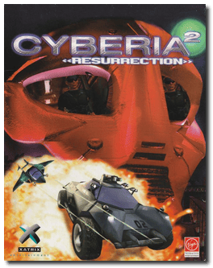
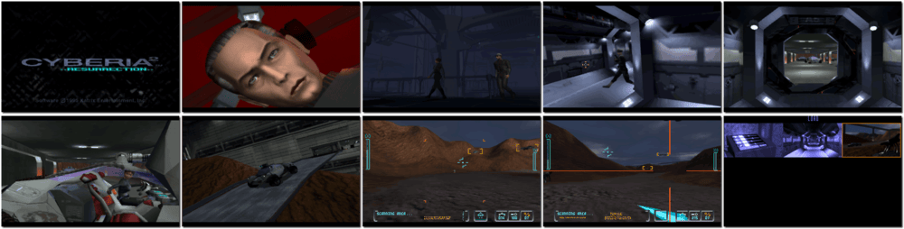

# Cyberia 2: Resurrection

「**Cyberia 2**」

> ❝ In Cyberia 2, the player takes the role of master cyber hacker Zak Kingston. After spending three years in cryonic hibernation, Zak has been mysteriously revived by a band of rebels bent on employing his services for a series of covert missions that will bring down the Free World Alliance (FWA) once and for all. ❞
>
> ❝ This game **is not abandonware 🚫** and is still for sale on [GOG 💰](https://gog.com/en/game/cyberia_2_resurrection) and [Steam 💰](https://store.steampowered.com/app/717720/Cyberia_2_Resurrection/). ❞
>

📌 ┃ **Year** ‣ 1995 ┃ **Genre** ‣ Action ┃ **Platform** ‣ DOS ┃ **License** ‣ Proprietary ┃ **Media** ‣ CD-ROM 

📦 ┃ **[DOSBox](https://www.dosbox.com/) 🟩** ┃ **[DOSBox Staging](https://dosbox-staging.github.io/) 🟩** ┃ **[DOSBox-X](https://dosbox-x.com/) 🟩** 

📎 ┃ **[Wikipedia](https://en.wikipedia.org/wiki/Cyberia_(video_game)#Cyberia_2:_Resurrection)** ┃ **[MobyGames](https://www.mobygames.com/game/809/cyberia-2-resurrection/)** ┃ **[MyAbandonware](https://www.myabandonware.com/game/cyberia-2-resurrection-cia)** ┃ **[GOG 💰](https://gog.com/en/game/cyberia_2_resurrection)** ┃ **[Steam 💰](https://store.steampowered.com/app/717720/Cyberia_2_Resurrection/)** 

## Additional Notes
- Mounted CD-ROM images at launch:
  1. Cyberia 2: Resurrection Disc #1
  2. Cyberia 2: Resurrection Disc #2

### How to swap CD-ROM images?
- [DOSBox](https://www.dosbox.com/wiki/DOSBox_FAQ#Swapping_CD_images) — Hotkey: CTRL+F4
- [DOSBox Staging](https://github.com/dosbox-staging/dosbox-staging/blob/main/README) — Hotkey: CTRL+F4 (or CMD+F4 on macOS)
- [DOSBox-X](https://dosbox-x.com/wiki/Guide%3AManaging-image-files-in-DOSBox%E2%80%90X#_mounting_multiple_cd_or_dvd_images) — Hotkey: F11+CTRL+C (or F12+D on macOS). Menu: DOS ‣ Swap CD drive.

---

