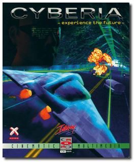
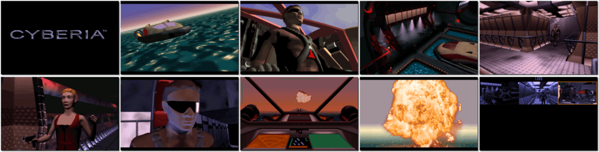

# Cyberia

「**Cyberia: -experience the future-**」

> ❝ The world is under the dominion of two opposing superpowers, the First World Alliance (FWA) in the west and the Cartel in the east. The leader of the FWA receives word that a devastating weapon is being produced in a secret base in Siberia, referred to as the Cyberia Complex. It was designed in an era of long-forgotten peace by the most brilliant minds in nano and cybernetic technology. In an ancient world of hope, it was to be the ultimate protector of a new order. In 2027, it stands as the instrument of humanity's destruction. You are Zak Kingston, tasked to infiltrate the Complex and retrieve any intel on the weapon production. ❞
>
> ❝ This game **is not abandonware 🚫** and is still for sale on [GOG 💰](https://www.gog.com/en/game/cyberia) and [Steam 💰](https://store.steampowered.com/app/624080/Cyberia/). ❞
>

📌 ┃ **Year** ‣ 1994 ┃ **Genre** ‣ Action ┃ **Platform** ‣ DOS ┃ **License** ‣ Proprietary ┃ **Media** ‣ CD-ROM ┃ **Patched** ‣ Save Game Fix 

📦 ┃ **[DOSBox](https://www.dosbox.com/) 🟩** ┃ **[DOSBox Staging](https://dosbox-staging.github.io/) 🟩** ┃ **[DOSBox-X](https://dosbox-x.com/) 🟩** 

📎 ┃ **[Wikipedia](https://en.wikipedia.org/wiki/Cyberia_(video_game))** ┃ **[MobyGames](https://www.mobygames.com/game/810/cyberia/)** ┃ **[MyAbandonware](https://www.myabandonware.com/game/cyberia-7pp)** ┃ **[GOG 💰](https://www.gog.com/en/game/cyberia)** ┃ **[Steam 💰](https://store.steampowered.com/app/624080/Cyberia/)** 

## Host Requirements
- Download a patch file manually from [MyAbandonware](https://www.myabandonware.com/game/cyberia-7pp) labeled *"Official patch English version 96 KB (DOS)"*, rename it to `patch.zip`, and place it in the `Assets` directory.

## Installation Notes
- Use the default **drive** and **directory** for the installation location.

---

