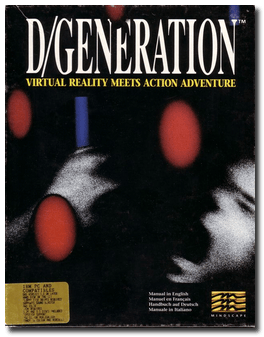
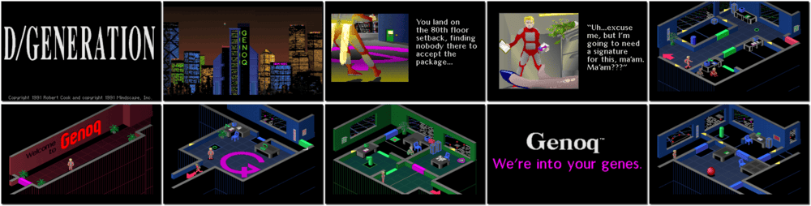

# D/Generation

「**D/Generation: Virtual Reality meets Action Adventure**」

> ❝ A French company called Genoq has developed a series of new genetically engineered bioweapons, which have run out of control and taken over Genoq's Singaporean lab. The main character is a courier making an emergency delivery by a jet pack to one of Genoq's top researchers, Jean-Paul Derrida, who is oblivious to the events inside the building until the lab's doors lock behind him after he enters. His point of delivery is ten floors away, all of them crawling with bioweapons. ❞
>
> ❝ This version is the original/legacy release for DOS. An **HD Remake** release is available on [Steam 💰](https://store.steampowered.com/app/389740/DGeneration_HD/). ❞
>

📌 ┃ **Year** ‣ 1991 ┃ **Genre** ‣ Action ┃ **Platform** ‣ DOS ┃ **License** ‣ Abandonware ┃ **Media** ‣ CD-ROM 

📦 ┃ **[DOSBox](https://www.dosbox.com/) 🟩** ┃ **[DOSBox Staging](https://dosbox-staging.github.io/) 🟩** ┃ **[DOSBox-X](https://dosbox-x.com/) 🟩** 

📎 ┃ **[Wikipedia](https://en.wikipedia.org/wiki/D/Generation)** ┃ **[MobyGames](https://www.mobygames.com/game/1274/dgeneration/)** ┃ **[MyAbandonware](https://www.myabandonware.com/game/d-generation-14l)** ┃ **HD Remake** ‣ [Steam 💰](https://store.steampowered.com/app/389740/DGeneration_HD/) 

## Installation Notes
- Use the default **drive** and **directory** for the installation location.

## Additional Notes
- A keyboard with *a numeric keypad* is preferred to play this game.

---

