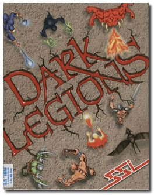
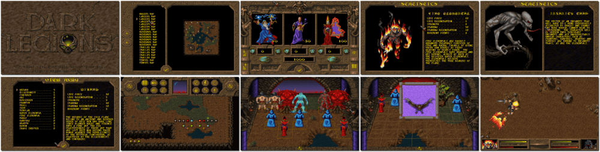

# Dark Legions

> ❝ You fight for universal power with the aid of the dark citizens from the Tahr Carog world. Similarly, your opponent uses his army of creatures to fight you. Each character type in Dark Legions has its strengths and weaknesses. Use them well you will be victorious; if you fail, abject humiliation will be the least of your worries. ❞
>
> ❝ This game **is not abandonware 🚫** and is still for sale on [GOG 💰](https://www.gog.com/en/game/dark_legions). ❞
>

📌 ┃ **Year** ‣ 1994 ┃ **Genre** ‣ Action • Strategy ┃ **Platform** ‣ DOS ┃ **License** ‣ Proprietary ┃ **Category** ‣ Diagonal-down • Top-down • Board game • Fighting • Fantasy ┃ **Media** ‣ Floppy Disk ┃ **Patched • Copy Protection** 

📦 ┃ **[DOSBox](https://www.dosbox.com/) 🟩** ┃ **[DOSBox Staging](https://dosbox-staging.github.io/) 🟩** ┃ **[DOSBox-X](https://dosbox-x.com/) 🟩** 

📎 ┃ **[Wikipedia](https://en.wikipedia.org/wiki/Dark_Legions)** ┃ **[MobyGames](https://www.mobygames.com/game/1350/dark-legions/)** ┃ **[AbandonwareDOS](https://www.abandonwaredos.com/abandonware-game.php?abandonware=Dark+Legions&gid=1249)** ┃ **[MyAbandonware](https://www.myabandonware.com/game/dark-legions-2ci)** ┃ **Manual** ‣ [Games Database](https://www.gamesdatabase.org/game/microsoft-dos/dark-legions) ┃ **[GOG 💰](https://www.gog.com/en/game/dark_legions)** 

## Installation Notes
- System Detection: Press `ENTER` to **Continue**.
- Use the default **drive** and **directory** for the installation location.
- Audio configuration:
  - Select **I Will**.
  - Do you have the *WaveBlaster* daughter board installed? Select **Pro 16**.
  - Do you have two sound cards installed in your machine? Select **Use 2**.
  - Select a Source for Music: **Roland SoundCanvas**. Confirm the settings.
  - Select a Source for Digital Sound Effects: **Sound Blaster 16 Asp**. Confirm the settings.

## Additional Notes
- Consult `Assets/manual.pdf` for the game copy protection.
- A desktop keyboard with *a numeric keypad* is preferred to play the two-player game.

