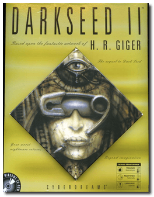
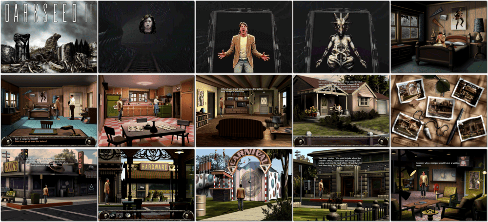

# Dark Seed II

> ❝ In his hometown, Mike's high school sweetheart, Rita, is found murdered after the high school reunion. Unfortunately, Mike has no recollection of the events that night, even though he was with Rita. Mike becomes the prime suspect and now must work to clear his name. In digging up the dirty little secrets of his neighbours, Mike unwittingly stumbles into the Dark World, a place he thought he would never see again. The ancients have returned to exact revenge on Mike and unleash an evil entity into the Normal World. As Mike Dawson, you must clear your name and stop the ancients from carrying out their most ingenious scheme yet. ❞
>

📌 ┃ **Year** ‣ 1995 ┃ **Genre** ‣ Adventure ┃ **Platform** ‣ Windows 3.1x ┃ **License** ‣ Abandonware ┃ **Media** ‣ CD-ROM 

📦 ┃ **[DOSBox](https://www.dosbox.com/) 🟩** ┃ **[DOSBox Staging](https://dosbox-staging.github.io/) 🟩** ┃ **[DOSBox-X](https://dosbox-x.com/) 🟩** 

📎 ┃ **[Wikipedia](https://en.wikipedia.org/wiki/Dark_Seed_II)** ┃ **[MobyGames](https://www.mobygames.com/game/4257/dark-seed-ii/)** ┃ **[MyAbandonware](https://www.myabandonware.com/game/dark-seed-ii-1rx)** 

## Installation Notes
- Dark Seed II Installation: Click **Continue**.
- Use the default **drive** and **directory** for the installation location.
- Select **Medium: scene data files, 40MB** installation level.
- Do not install *Video for Windows*. Click **Exit** when prompted. Your Windows 3.1x has the most recent version.
- Exit Windows and DOSBox once the installation is complete (**Program Manager ‣ File ‣ Exit Windows**) and rerun the `Launch` script to start the program.

## Additional Notes
- In the game **Options**:
  - 320x240 Animations: Select **640x480, zoom by 2**.
  - Dialog Option: Select **Audio and Text**.

---

