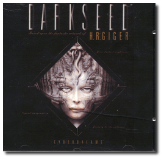
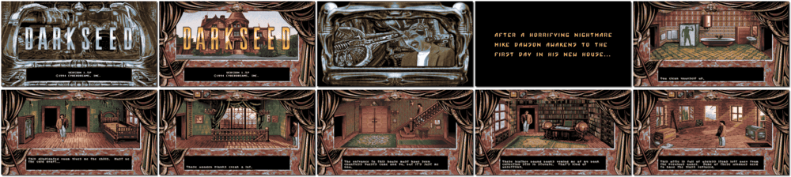

# Dark Seed

> ❝ You are Mike Dawson, a science fiction writer who purchased an old Victorian house. As you explore your new home, you soon discover you have bought more than you bargained for. Control the fate of two worlds: The world as we know it and the dark world of an ancient and dying civilization. Unlock the secret of a sinister plot and discover the dark passage to their world, a place more terrifying than your darkest nightmare. Time is running out. You are on a collision course with destiny, and only you can save yourself and the world from a cruel fate. All of humanity depends on you. ❞
>

📌 ┃ **Year** ‣ 1992 ┃ **Genre** ‣ Adventure ┃ **Platform** ‣ DOS ┃ **License** ‣ Abandonware ┃ **Media** ‣ CD-ROM 

📦 ┃ **[DOSBox](https://www.dosbox.com/) 🟩** ┃ **[DOSBox Staging](https://dosbox-staging.github.io/) 🟩** ┃ **[DOSBox-X](https://dosbox-x.com/) 🟩** 

📎 ┃ **[Wikipedia](https://en.wikipedia.org/wiki/Dark_Seed_(video_game))** ┃ **[MobyGames](https://www.mobygames.com/game/302/dark-seed/)** ┃ **[MyAbandonware](https://www.myabandonware.com/game/dark-seed-1dl)** 

## Installation Notes
- Shall we continue? Press `Y`.
- Use the default **drive** and **directory** for the installation location.

---

