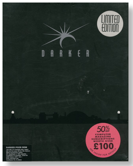
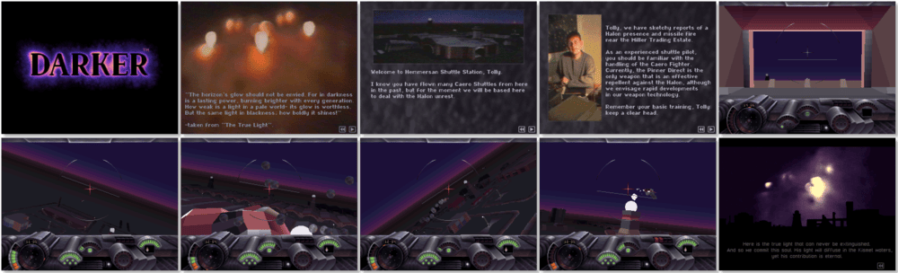

# Darker

> ❝ Your side of the planet is constantly in total darkness, but the Delphins have adapted to this life. The Halons used to live in the light, but recent events have caused their side of the planet to fall dark, and now they are attacking you to take over your technology. Your job as a Delphin pilot is to stop them and take down their attacking ships. ❞
>

📌 ┃ **Year** ‣ 1995 ┃ **Genre** ‣ Action • Simulation ┃ **Platform** ‣ DOS ┃ **License** ‣ Abandonware ┃ **Media** ‣ CD-ROM 

📦 ┃ **[DOSBox](https://www.dosbox.com/) 🟩** ┃ **[DOSBox Staging](https://dosbox-staging.github.io/) 🟩** ┃ **[DOSBox-X](https://dosbox-x.com/) 🟩** 

📎 ┃ **[Wikipedia](https://en.wikipedia.org/wiki/Darker_(video_game))** ┃ **[MobyGames](https://www.mobygames.com/game/13833/darker/)** ┃ **Manual** ‣ [MyAbandonware 📄](https://www.myabandonware.com/game/darker-2dn) 

## Installation Notes
- Select your preferred language (`E`nglish, `F`rançais, `D`eutsche)
- Select sound card to be used for MUSIC: Press `1` for Soundblaster.
- Use the default **drive** and **directory** for the installation location.

---

