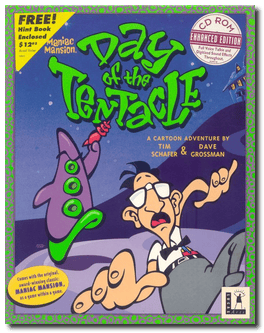
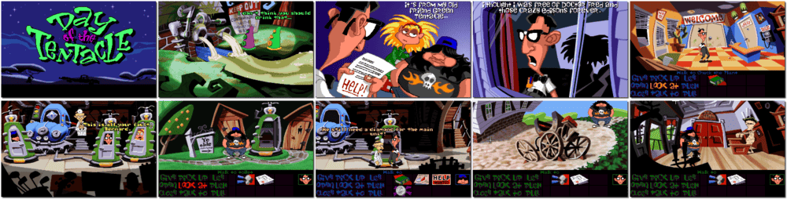

# Day of the Tentacle

「**Maniac Mansion: Day of the Tentacle**」「**Maniac Mansion II**」

> ❝ Dr. Fred's mutated purple tentacle is out to take over the world. And only you can stop him. Travel through time with three outrageous characters in this wacky graphic adventure featuring cartoon-style animation and over 100 zany sound effects. ❞
>
> ❝ This version is the original/legacy release for DOS. A **Remastered** release is available on [GOG 💰](https://www.gog.com/en/game/day_of_the_tentacle_remastered). ❞
>

📌 ┃ **Year** ‣ 1993 ┃ **Genre** ‣ Adventure ┃ **Platform** ‣ DOS ┃ **License** ‣ Proprietary ┃ **Category** ‣ Side view • Graphic adventure • Puzzle elements • Comedy ┃ **Media** ‣ CD-ROM 

📦 ┃ **[DOSBox](https://www.dosbox.com/) 🟩** ┃ **[DOSBox Staging](https://dosbox-staging.github.io/) 🟩** ┃ **[DOSBox-X](https://dosbox-x.com/) 🟩** 

📎 ┃ **[Wikipedia](https://en.wikipedia.org/wiki/Day_of_the_Tentacle)** ┃ **[MobyGames](https://www.mobygames.com/game/719/maniac-mansion-day-of-the-tentacle/)** ┃ **[AbandonwareDOS](https://www.abandonwaredos.com/abandonware-game.php?abandonware=Day+of+the+Tentacle&gid=1304)** ┃ **[MyAbandonware](https://www.myabandonware.com/game/maniac-mansion-day-of-the-tentacle-1t0)** ┃ **Remastered** ‣ [GOG 💰](https://www.gog.com/en/game/day_of_the_tentacle_remastered) 

## Installation Notes
- Setup Utility:
  - Music: **SoundBlaster & Compatibles / AdLib**.
  - Voice: **SoundBlaster & Compatibles**; Port: **220**; IRQ: **7**; Buffer: **8** [*DOSBox-X and DOSBox-Staging*] or **2** [*DOSBox*].
  - Control: **Mouse + keyboard**.
  - Press `ESC` to Exit Setup and press `Y` to Save Settings.

