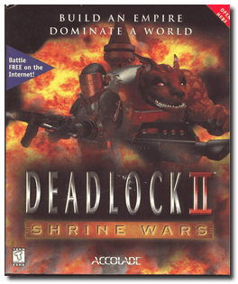

# Deadlock II: Shrine Wars

「**Deadlock 2**」

> ❝ Ancient and mysterious Shrines reveal the location of an extinct alien homeworld. Discovered in the aftermath of the Gallius IV war, these Shrines unlock the most powerful technology in the universe. Now, seven interstellar empires must battle to establish their colonies and attempt to piece together the ancient secrets of a lost world. ❞
>
> ❝ This game **is not abandonware 🚫** and is still for sale on [GOG 💰](https://www.gog.com/en/game/deadlock_2_shrine_wars) and [Steam 💰](https://store.steampowered.com/app/328450/Deadlock_II_Shrine_Wars/). ❞
>

📌 ┃ **Year** ‣ 1998 ┃ **Genre** ‣ Strategy ┃ **Platform** ‣ Windows 98SE ┃ **License** ‣ Proprietary ┃ **Media** ‣ CD-ROM 

📦 ┃ **[DOSBox](https://www.dosbox.com/) ⬜ • Untested** ┃ **[DOSBox Staging](https://dosbox-staging.github.io/) ⬜ • Untested** ┃ **[DOSBox-X](https://dosbox-x.com/) 🟩** 

📎 ┃ **[Wikipedia](https://en.wikipedia.org/wiki/Deadlock_II:_Shrine_Wars)** ┃ **[MobyGames](https://www.mobygames.com/game/2298/deadlock-ii-shrine-wars/)** ┃ **[MyAbandonware](https://www.myabandonware.com/game/deadlock-ii-shrine-wars-cwe)** ┃ **[GOG 💰](https://www.gog.com/en/game/deadlock_2_shrine_wars)** ┃ **[Steam 💰](https://store.steampowered.com/app/328450/Deadlock_II_Shrine_Wars/)** ┃ **[Game Manual 📄](https://www.dropbox.com/s/4hzzdxkxvusyjad/Deadlock_II_-_Manual%5B1%5D.pdf)** 

## Installation Notes
- Open *My Computer* and double-click on the `D:` CD-ROM drive to start the installation.
- **DO NOT** install *DirectX* or *Direct Media* when prompted.
- Select the largest installation size when prompted.
- Use the default **drive** and **directory** for the installation location.

## Additional Notes
- The Manual PDF document provided in the CD-ROM is incorrectly rendered. Download the proper document from this [link](https://www.dropbox.com/s/4hzzdxkxvusyjad/Deadlock_II_-_Manual%5B1%5D.pdf).

---

