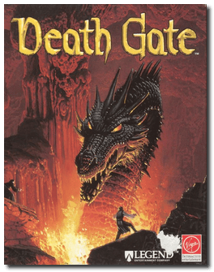
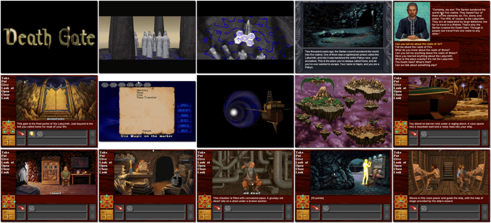

# Death Gate

> ❝ Long ago, the powerful Sartans broke the World Seal and sundered the planet into five magical realms. Since then, generations of defeated Patryns have survived bleak existence in the nightmarish prison of the Labyrinth. But now, one man discovers the Death Gate, a treacherous crossing that leads to freedom. His quest: to recover the scattered pieces of the World Seal, wreak his revenge and deliver his people into independence. ❞
>
> ❝ GOG.com released an emulated version for Microsoft Windows, macOS, and Linux in January 2018. It was removed from sale two months later. ❞ — *Wikipedia*
>
> ❝ This game **is not abandonware 🚫** and used to be for sale on **GOG**. However, it is no longer available digitally anymore. [What happened to 'Death Gate'?](https://www.gog.com/forum/death_gate/what_happened_to_death_gate) ❞
>

📌 ┃ Year: **1994** ┃ Genre: **Adventure** ┃ Platform: **DOS** ┃ License: **Proprietary** ┃ Category: **1st-person • Puzzle elements • Fantasy** ┃ Media: **CD-ROM** 

📦 ┃ **[DOSBox](https://www.dosbox.com/) 🟩** ┃ **[DOSBox Staging](https://dosbox-staging.github.io/) 🟩** ┃ **[DOSBox-X](https://dosbox-x.com/) 🟩** 

📎 ┃ **[Wikipedia](https://en.wikipedia.org/wiki/Death_Gate)** ┃ **[MobyGames](https://www.mobygames.com/game/175/death-gate/)** ┃ **[AbandonwareDOS](https://www.abandonwaredos.com/abandonware-game.php?abandonware=Death+Gate&gid=2037)** ┃ **[MyAbandonware](https://www.myabandonware.com/game/death-gate-2pf)** ┃ **[GOG ❓](https://www.gog.com/forum/general/release_bdeath_gateb_18b63)** 

## Installation Notes
- Display Mode: **640x480 VESA compatible**.
- Installation Options: **Optimum Performance Installation**.
- Use the default **drive** and **directory** for the installation location.
- Test Option: **Proceed with performance test**.
- Music Device: **Sound Blaster 16**.
- Digitized Sound: **Sound Blaster 16**.

