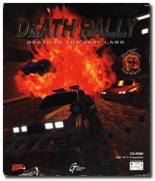
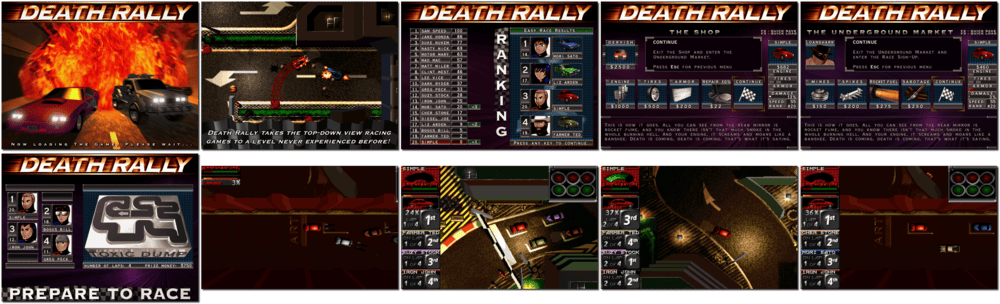

# Death Rally

「**Death Race**」「**Death Rally: Death in the Fast Lane**」「**Hi-Speed**」

> ❝ Enter the corrupt racing world of Death Rally, where defensive driving means annihilating your opponents. You'll become ravenous for the power and glory of being the best at Death Rally, but first, you must pay your dues. Put the pedal to the metal and smash, blast and obliterate the competition to earn the chance to face the undefeated master, "The Adversary." Make deals with loan sharks and mob bosses to get the cash you need to build the ultimate battle racing machine. Remember, no trick is too dirty, and no spectator is too innocent - in your savage quest for the checkered flag. ❞
>
> ❝ Based on Komppa's work, Remedy released Death Rally for Windows as proprietary freeware on 20 October 2009. ❞ — *Wikipedia*
>

📌 ┃ **Year** ‣ 1996 ┃ **Genre** ‣ Action • Racing ┃ **Platform** ‣ DOS ┃ **License** ‣ Freeware ┃ **Media** ‣ CD-ROM 

📦 ┃ **[DOSBox](https://www.dosbox.com/) 🟩** ┃ **[DOSBox Staging](https://dosbox-staging.github.io/) 🟩** ┃ **[DOSBox-X](https://dosbox-x.com/) 🟩** 

📎 ┃ **[Wikipedia](https://en.wikipedia.org/wiki/Death_Rally)** ┃ **[MobyGames](https://www.mobygames.com/game/256/death-rally/)** ┃ **[MyAbandonware](https://www.myabandonware.com/game/death-rally-a14)** ┃ **[Steam 🆓](https://store.steampowered.com/app/358270/Death_Rally_Classic/)** 

## Installation Notes
- Please pick a Death Rally installation option: **Full Install - 44.6Mb of HD space required.**
- Use the default **drive** and **directory** for the installation location.
- Choose Sound Card: **Sound Blaster MONO/PRO/16/AWE32**, Port: **0x220**, Interrupt: **IRQ 7**, DMA: **DMA channel 5**.

---

