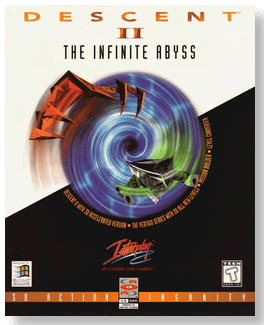
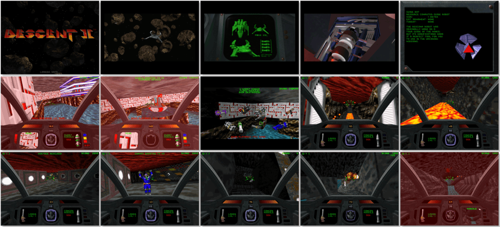

# Descent II

「**Descent II: The Infinite Abyss** (Base)」「**Descent II: Vertigo Series** (Add-on)」

> ❝ You're about to plunge over the edge and into the depths of Descent II. Suddenly warped into the outer reaches of the Zeta Aquilae System, your new mission sends you into the black depths of treacherous alien mines. You blast through enemy robots with powerful new tools, leaving their flaming hulks in your exhaust. Your ultimate goal is to exterminate the alien robot stronghold from the enemy Alien Base and claim total control. ❞
>
> ❝ This game **is not abandonware 🚫** and is still for sale on [GOG 💰](https://www.gog.com/en/game/descent_2) and [Steam 💰](https://store.steampowered.com/app/273580/Descent_2/). ❞
>

📌 ┃ **Year (Descent II)** ‣ 1996 ┃ **Year (Descent II: The Infinite Abyss)** ‣ 1996 ┃ **Year (Descent II: Vertigo Series)** ‣ 1996 ┃ **Genre** ‣ Action ┃ **Platform** ‣ DOS ┃ **License** ‣ Proprietary ┃ **Media** ‣ CD-ROM ┃ **Add-on** 

📦 ┃ **[DOSBox](https://www.dosbox.com/) 🟩** ┃ **[DOSBox Staging](https://dosbox-staging.github.io/) 🟩** ┃ **[DOSBox-X](https://dosbox-x.com/) 🟩** 

📎 ┃ **Descent II** ‣ [Wikipedia](https://en.wikipedia.org/wiki/Descent_II) • [MobyGames](https://www.mobygames.com/game/694/descent-ii/) • [MyAbandonware](https://www.myabandonware.com/game/descent-ii-3ir) ┃ **Descent II: The Infinite Abyss** ‣ [MobyGames](https://www.mobygames.com/game/1061/descent-ii-the-infinite-abyss/) ┃ **Descent II: Vertigo Series** ‣ [MobyGames](https://www.mobygames.com/game/27145/descent-ii-vertigo-series/) • [MyAbandonware](https://www.myabandonware.com/game/descent-ii-vertigo-series-fqw) ┃ **[GOG 💰](https://www.gog.com/en/game/descent_2)** ┃ **[Steam 💰](https://store.steampowered.com/app/273580/Descent_2/)** 

## Installation Notes
- *Descent II: The Infinite Abyss* installation:
  - Select **Yes** to continue installation.
  - High resolution movies are recommended: **Accept this resolution**.
  - Installation choices: **Crazy 262 MB**.
  - Use the default **drive** and **directory** for the installation location.
  - Do you wish to install the S3 Virge version of D2? **Yes**.
  - Main menu:
    - Select **Setup Sound/Music ‣ Auto Detect Sound Hardware ‣ Continue with Auto Detection ‣ Select this sound card ‣ Done Sound and Music**.
    - Select **Exit**.
- *Descent II: Vertigo Series* installation:
  - Use the default **drive** and **directory** for the installation location.

---

