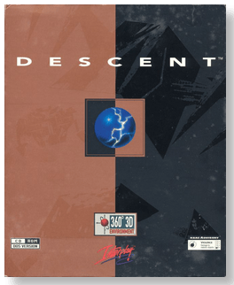
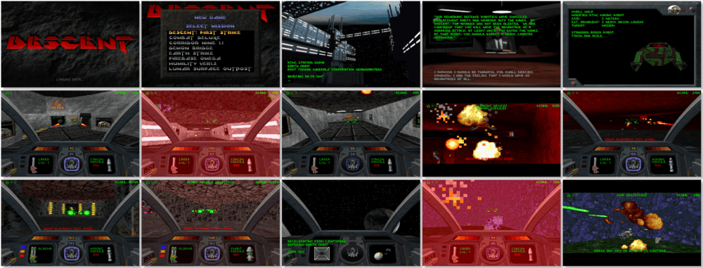

# Descent: Anniversary Edition

「**Descent** (Base)」「**Descent: Levels of the World** (Add-on)」「**Inferno**」

> ❝ You begin deep below the surface of Lunar Base I, where an unknown alien race has taken over the chasm of the Post-Terran Mining Corporation. Lunge down mine shafts, twist around never-ending tunnels and fight past robotic menaces in a 360° 3D environment. Move up, move down, shoot everything everywhere. Hang onto your senses (and your lunch) as you drop down mine shafts on a ride that'll leave you spinning. ❞
>
> ❝ This game **is not abandonware 🚫** and is still for sale on [GOG 💰](https://www.gog.com/en/game/descent) and [Steam 💰](https://store.steampowered.com/app/273570/Descent/). ❞
>

📌 ┃ **Year (Descent)** ‣ 1995 ┃ **Year (Descent: Levels of the World)** ‣ 1995 ┃ **Genre** ‣ Action ┃ **Platform** ‣ DOS ┃ **License** ‣ Proprietary ┃ **Media** ‣ CD-ROM ┃ **Add-on** 

📦 ┃ **[DOSBox](https://www.dosbox.com/) 🟩** ┃ **[DOSBox Staging](https://dosbox-staging.github.io/) 🟩** ┃ **[DOSBox-X](https://dosbox-x.com/) 🟩** 

📎 ┃ **Descent** ‣ [Wikipedia](https://en.wikipedia.org/wiki/Descent_(video_game)) • [MobyGames](https://www.mobygames.com/game/692/descent/) • [MyAbandonware](https://www.myabandonware.com/game/descent-2rd) ┃ **Descent: Levels of the World** ‣ [MobyGames](https://www.mobygames.com/game/19253/descent-levels-of-the-world/) • [MyAbandonware](https://www.myabandonware.com/game/descent-levels-of-the-world-2re) ┃ **[GOG 💰](https://www.gog.com/en/game/descent)** ┃ **[Steam 💰](https://store.steampowered.com/app/273570/Descent/)** 

## Installation Notes
- Use the default **drive** and **directory** for the installation location.
- Do you have the shareware version of Descent installed on this machine? Select **Don't Copy Data Files**.
- Select **Install Descent**.
- Main menu:
  - Select **Auto Detect Sound Hardware ‣ Continue with Auto Detection ‣ Select this sound card**.
  - Select **Exit**.

---

