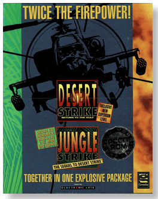
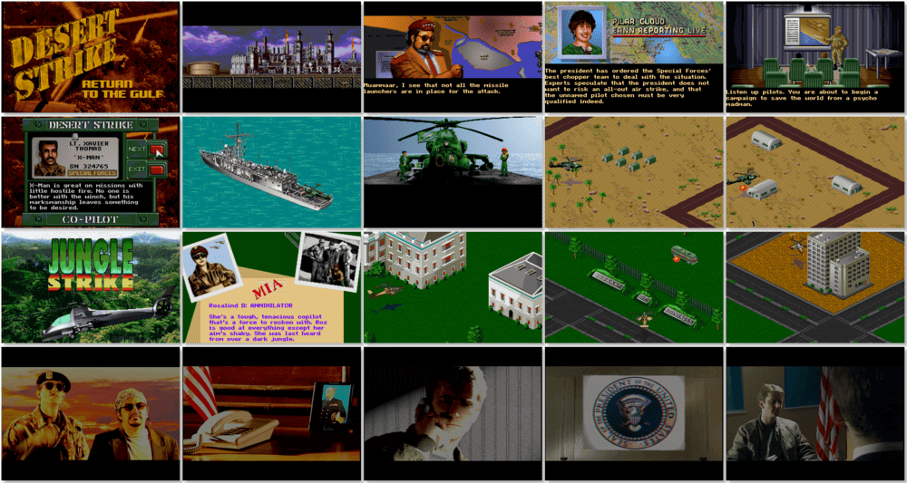

# Desert Strike and Jungle Strike

「**Desert Strike: Return to the Gulf**」「**Jungle Strike**」

> ❝ A self-proclaimed general named Kilbaba is invading one of his neighbours. Installing himself as a dictator, Kilbaba quickly begins fortifying his position with military weapons and installations, including facilities for building nuclear bombs. The United States decides to send in a single helicopter, piloted by you and aided by a co-pilot, to infiltrate and destroy Kilbaba's forces in a series of swift strikes. ❞ — *Desert Strike*
>
> ❝ Ibn Kilbaba, son of Kilbaba Sr., threatens to annihilate America. Kilbaba hires Carlos Ortega to help him set up his nuclear weapons program deep in South America. Carlos Ortega, the world's most notorious drug lord, also yearns to seek revenge. The United States sends you to fight them. You will fight Ibn Kilbaba and Carlos Ortega's private armies with the Comanche attack helicopter. ❞ — *Jungle Strike*
>

📌 ┃ **Year (Desert Strike: Return to the Gulf)** ‣ 1994 ┃ **Year (Jungle Strike)** ‣ 1995 ┃ **Genre** ‣ Action ┃ **Platform** ‣ DOS ┃ **License** ‣ Abandonware ┃ **Media** ‣ CD-ROM 

📦 ┃ **[DOSBox](https://www.dosbox.com/) 🟩** ┃ **[DOSBox Staging](https://dosbox-staging.github.io/) 🟩** ┃ **[DOSBox-X](https://dosbox-x.com/) 🟩** 

📎 ┃ **Desert Strike: Return to the Gulf** ‣ [Wikipedia](https://en.wikipedia.org/wiki/Desert_Strike) • [MobyGames](https://www.mobygames.com/game/1461/desert-strike-return-to-the-gulf/) • [MyAbandonware](https://www.myabandonware.com/game/desert-strike-return-to-the-gulf-299) ┃ **Jungle Strike** ‣ [Wikipedia](https://en.wikipedia.org/wiki/Jungle_Strike) • [MobyGames](https://www.mobygames.com/game/792/jungle-strike/) • [MyAbandonware](https://www.myabandonware.com/game/jungle-strike-235) ┃ **Desert Strike and Jungle Strike** ‣ [MobyGames](https://www.mobygames.com/game/2733/desert-strike-and-jungle-strike/) • [MyAbandonware](https://www.myabandonware.com/game/desert-strike-and-jungle-strike-e3j) 

## Installation Notes
- Installing **Desert Strike: Return to the Gulf**
  - Which drive do you want Desert Strike installed on? Press `C`.
  - Do you want the game to be put in a directory called `DESERT`? Press `Y`.
  - Do you want to do a quick install? Press `Y`.
- Installing **Jungle Strike**
  - Which drive do you want Jungle Strike installed on? Press `C`.
  - Do you want the game to be put in a directory called `JUNGLE`? Press `Y`.
  - Do you want to do a full install? Press `Y`.
  - For **DOSBox** and **DOSBox Staging** variant:
    - Do you want the game to play video sequences? Press `N`.
  - For **DOSBox-X** variant:
    - Do you want the game to play video sequences? Press `Y`.
    - Please select video size: Press `3`.

---

