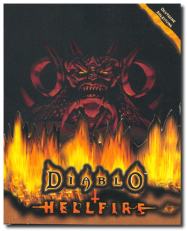
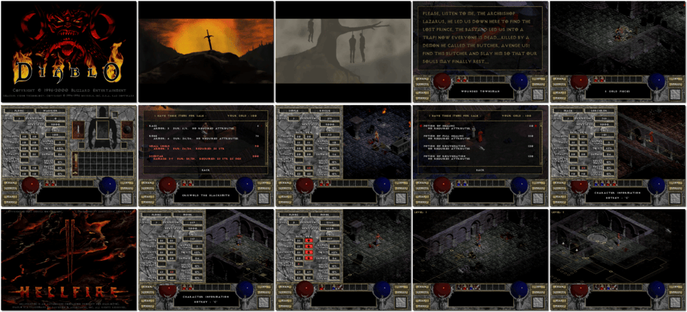

# Diablo + Hellfire

「**Diablo** (Base)」「**Diablo: Hellfire** (Add-on)」

> ❝ Vengeance, power, intellect and magic are the tools you will need to battle the Lord of All Evil, Diablo. Embark, if you dare, upon a dark and sinister quest that will pull you into the very depths of Hell itself and beyond. ❞ — *Diablo*
>
> ❝ Hellfire introduces players to new quests revolving around a powerful demon known as Na-Krul. A creature who once served as Diablo's chief minion and ally, Na-Krul and his cohorts rebelled against Diablo and, after a failed attempt to overthrow their master, were banished to the Void. Freed by an evil sorcerer, Na-Krul has set up command in the ancient Demon Crypts and has once again started his plans to destroy Diablo and spread the evils of Hell throughout the world. Gathering together a small army of never-before-seen monsters, Na-Krul poses an even more threat than Diablo. ❞ — *Hellfire*
>
> ❝ This game **is not abandonware 🚫** and is still for sale on [GOG 💰](https://www.gog.com/en/game/diablo). ❞
>

📌 ┃ **Year (Diablo)** ‣ 1996 ┃ **Year (Hellfire)** ‣ 1997 ┃ **Genre** ‣ Role-playing ┃ **Platform** ‣ Windows 9x ┃ **License** ‣ Proprietary ┃ **Media** ‣ CD-ROM ┃ **Patched** ‣ 1.09 (Diablo) ┃ **Patched** ‣ 1.01 (Hellfire) ┃ **Add-on** 

📦 ┃ **[DOSBox](https://www.dosbox.com/) ⬜ • Untested** ┃ **[DOSBox Staging](https://dosbox-staging.github.io/) ⬜ • Untested** ┃ **[DOSBox-X](https://dosbox-x.com/) 🟩** 

📎 ┃ **Diablo** ‣ [Wikipedia](https://en.wikipedia.org/wiki/Diablo_(video_game)) • [MobyGames](https://www.mobygames.com/game/339/diablo/) • [MyAbandonware](https://www.myabandonware.com/game/diablo-3it) ┃ **Hellfire** ‣ [Wikipedia](https://en.wikipedia.org/wiki/Diablo:_Hellfire) • [MobyGames](https://www.mobygames.com/game/1462/hellfire/) • [MyAbandonware](https://www.myabandonware.com/game/hellfire-9z8) ┃ **Diablo + Hellfire** ‣ [MobyGames](https://www.mobygames.com/game/1853/diablo-hellfire/) ┃ **[Series](https://en.wikipedia.org/wiki/Diablo_(series))** ┃ **[GOG 💰](https://www.gog.com/en/game/diablo)** 

## Host Requirements
- Download a *Diablo* patch file manually from [MyAbandonware](https://www.myabandonware.com/game/diablo-3it) labeled *"Patch 1.09 English version 2 MB (Windows)"*, rename it to `pdiablo.zip`, and place it in the `Assets` directory.
- Download a *Hellfire* patch file manually from [MyAbandonware](https://www.myabandonware.com/game/hellfire-9z8) labeled *"Patch 1.01 English version 576 KB (Windows)"*, rename it to `phell.zip`, and place it in the `Assets` directory.

## Installation Notes
- Open *My Computer* and double-click on the `D:` CD-ROM drive to start the installation.
- Use the default **drive** and **directory** for the installation location.
- Check all components to be installed when prompted. Ignore demo game installation.
- First install **Diablo** then swap CD-ROM image to **Hellfire** and install the add-on.
- Swap CD-ROM image back to **Diablo** to play both the base game and the expansion.
- Applying patches:
  - A patch for *Diablo v1.09* is available on `C:\PATCH\PDIABLO.ZIP`. Extract the compressed file and run `DRTL109.EXE`.
  - A patch for *Hellfire v1.01* is available on `C:\PATCH\PHELL.ZIP`. Extract the compressed file and run `HF101.EXE`.

## Additional Notes
- Mounted CD-ROM images at launch:
  1. Diablo (required to be in the CD-ROM drive to play *Diablo* or *Hellfire*)
  2. Hellfire (installation data only)
- Swapping CD-ROM disc when multiple images are mounted: From DOSBox-X menu **DOS ‣ Swap CD drive**.

---

