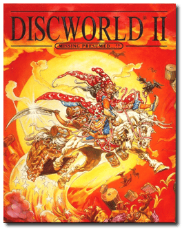
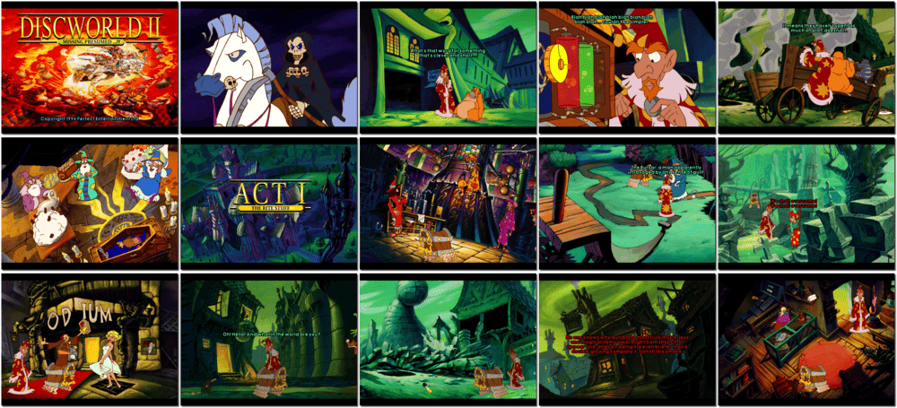

# Discworld II: Missing presumed...!?

「**Discworld II: Mortality Bytes!** (North American)」「**Discworld II**」

> ❝ Death has gone missing. It means those whose time is up are faltering around in limbo. A hero is needed to bring him back. But there's only Rincewind, an incompetent wizard and highly trained coward. You won't catch Rincewind running away. He is too fast. Unfortunately, he is all standing between people and the horrible prospect of immortality. No one wants that, do they? ❞
>

📌 ┃ **Year** ‣ 1996 ┃ **Genre** ‣ Adventure ┃ **Platform** ‣ DOS ┃ **License** ‣ Abandonware ┃ **Media** ‣ CD-ROM ┃ **Patched** ‣ #3 

📦 ┃ **[DOSBox](https://www.dosbox.com/) 🟩** ┃ **[DOSBox Staging](https://dosbox-staging.github.io/) 🟩** ┃ **[DOSBox-X](https://dosbox-x.com/) 🟩** 

📎 ┃ **[Wikipedia](https://en.wikipedia.org/wiki/Discworld_II:_Missing_Presumed...!%3F)** ┃ **[MobyGames](https://www.mobygames.com/game/1370/discworld-ii-mortality-bytes/)** ┃ **[MyAbandonware](https://www.myabandonware.com/game/discworld-ii-mortality-bytes-48i)** 

## Installation Notes
- Press `ENTER` to begin video mode analysis.
- Use the default **drive** and **directory** for the installation location.
- Select and configure digital audio driver: **Creative Labs Sound Blaster 16 or AWE32** (*Attempt to configure sound driver automatically*).

---

