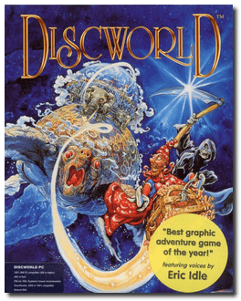
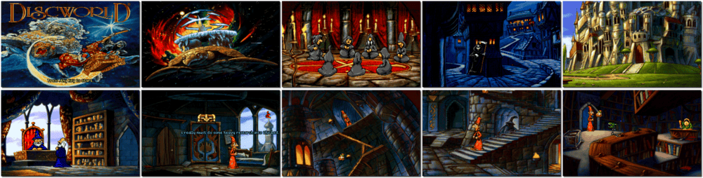

# Discworld

「**Discworld: The Trouble With Dragons**」「**Terry Pratchett's Discworld**」

> ❝ You will find wizards, dragons, heroes, and household hygiene specialists. There is danger here, but there is also custard around the place. Discworld is a fantasy world with a low reality threshold. The real world keeps on breaking through, but Discworld changes it. However, because it is a fantasy world, there are some things that it has to have, and one of them is a certain tendency to experience some trouble with dragons. Unfortunately, a dragon is now ravaging Ankh-Morpork, the world's leading city. Many people consider this a civic improvement, but Ankh-Morpork needs a hero. All they have, however, is Rincewind, a wizard whose only talent is that he is not, in fact, dead yet. He also has the Luggage, the nastiest piece of travelware in the universe. With that at his side, there is probably no limit to things he can fail to do. Oh, did I say he? I meant you. ❞
>

📌 ┃ **Year** ‣ 1995 ┃ **Genre** ‣ Adventure ┃ **Platform** ‣ DOS ┃ **License** ‣ Abandonware ┃ **Media** ‣ CD-ROM ┃ **Patched** ‣ 1.04 

📦 ┃ **[DOSBox](https://www.dosbox.com/) 🟩** ┃ **[DOSBox Staging](https://dosbox-staging.github.io/) 🟩** ┃ **[DOSBox-X](https://dosbox-x.com/) 🟩** 

📎 ┃ **[Wikipedia](https://en.wikipedia.org/wiki/Discworld_(video_game))** ┃ **[MobyGames](https://www.mobygames.com/game/184/discworld/)** ┃ **[MyAbandonware](https://www.myabandonware.com/game/discworld-2r9)** 

## Installation Notes
- Use the default **drive** and **directory** for the installation location.
- Select and configure MIDI music driver: **Creative Labs Sound Blaster(TM) 16** (*Attempt to configure sound driver automatically*).
- Select and configure digital audio driver: **Creative Labs Sound Blaster 16 or AWE32** (*Attempt to configure sound driver automatically*).

---

