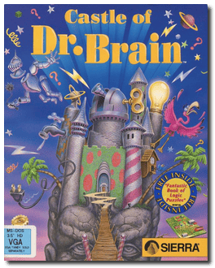
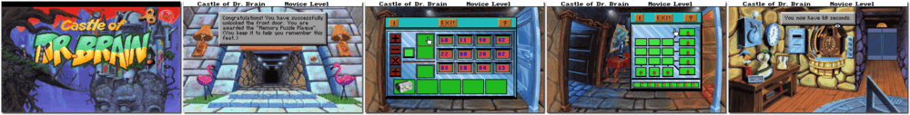

# Castle of Dr. Brain

「**Dr. Brain 1**」「**Mathemagical Mansion**」

> ❝ Are you the most creative person you know? Can you react quickly to new challenges? Would you like to save the world from certain destruction? Do you need a job? I need an assistant to help me explore the inner workings of time, space and reality. The successful candidate will have a thirst for knowledge, a sense of humour, and a love of pizza. Apply in person at the Castle of Dr Brain. ❞
>

📌 ┃ **Year** ‣ 1991 ┃ **Genre** ‣ Educational • Puzzle ┃ **Platform** ‣ DOS ┃ **License** ‣ Abandonware ┃ **Category** ‣ 1st-person • Real-time • Graphic adventure • Mini-games • Math • Reading • Science ┃ **Media** ‣ Floppy Disk ┃ **Copy Protection** 

📦 ┃ **[DOSBox](https://www.dosbox.com/) 🟩** ┃ **[DOSBox Staging](https://dosbox-staging.github.io/) 🟩** ┃ **[DOSBox-X](https://dosbox-x.com/) 🟩** 

📎 ┃ **[Wikipedia](https://en.wikipedia.org/wiki/Castle_of_Dr._Brain)** ┃ **[MobyGames](https://www.mobygames.com/game/1523/castle-of-dr-brain/)** ┃ **[AbandonwareDOS](https://www.abandonwaredos.com/abandonware-game.php?abandonware=Castle+of+Dr.+Brain&gid=2075)** ┃ **[MyAbandonware](https://www.myabandonware.com/game/castle-of-dr-brain-1b8)** ┃ **[Series](https://en.wikipedia.org/wiki/Dr._Brain)** ┃ **Manual** ‣ [Games Database](https://www.gamesdatabase.org/game/microsoft-dos/castle-of-dr-brain) 

## Installation Notes
- Use the default **drive** and **directory** for the installation location.
  - Please type the letter of the hard drive to which you want to install this game: Press `C`.
- Music: **Sound Blaster / AdLib Card (or compatibles)**.
- Accept these choices and begin installation.

## Additional Notes
- Consult `Assets/manual.pdf` for the game copy protection.

